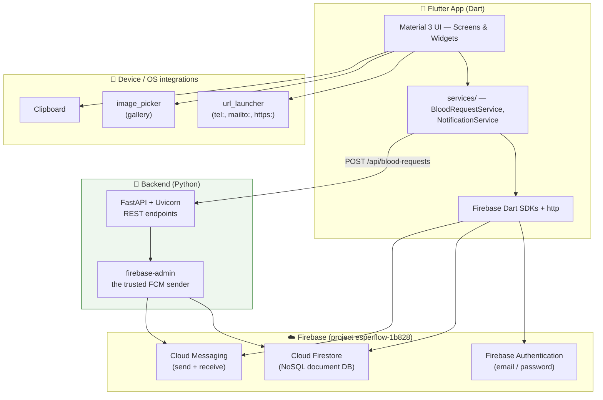

# Chapter 1 — Introduction & Project Overview

[← Table of Contents](README.md) · [Next: Architecture →](02-architecture.md)

---

## 1.1 What is EsperFlow?

**EsperFlow** is a **Flutter mobile application that connects blood donors with people who need blood.** The name evokes *esper* (hope) + *flow* (of blood/life). Its purpose is to shorten the time between "someone urgently needs blood" and "a matching donor is reached," using a single community-driven app instead of scattered phone chains and social-media posts.

The app is built as a **Flutter front end talking mostly directly to Firebase**, plus one small **FastAPI backend** in [`backend/`](../backend/README.md). Persistence and authentication are Firebase's; the backend exists for the single job a mobile client is not allowed to do — holding the Firebase Admin credentials that *send* a push notification to every registered donor.

### The problem it addresses
Finding a compatible blood donor quickly is hard: blood banks are fragmented, urgent requests spread by word of mouth, and there is no shared directory of willing donors. EsperFlow's vision (stated verbatim in the app's About screen) is:

> "…to create a centralized platform that bridges the gap between blood donors and those in need … a reliable, efficient, and accessible system that connects willing donors with recipients during critical times."

— see [`lib/screens/about_us_screen.dart`](../frontend/lib/screens/about_us_screen.dart)

---

## 1.2 Who this book (and app) is for

| Audience | What they get |
|----------|---------------|
| **A new developer** joining the project | A complete map of the code, the data model, the known gaps, and how to run it — start at [Chapter 3](03-getting-started.md). |
| **A reviewer / instructor** | An honest assessment of what is implemented vs. stubbed — see §1.2 below and [Chapter 15](15-troubleshooting.md). |
| **A product/design owner** | The feature inventory and roadmap implications. |
| **End users** (conceptually) | Blood recipients, blood donors, and people in a medical emergency in Pakistan — the seed data (hospitals, helplines, organizations) is Pakistan-specific, mostly Lahore. |

---

## 1.3 Key features (as built in the UI)

EsperFlow ships twelve screens. Here is what each one is *for*:

| Feature | Screen file | Status today |
|---------|-------------|--------------|
| **Home dashboard** (menu of features) | [`home_screen.dart`](../frontend/lib/screens/home_screen.dart) | ✅ Works; only 2 menu tiles active |
| **Request blood** (post a need) | [`blood_request_screen.dart`](../frontend/lib/screens/blood_request_screen.dart) | ✅ Saves to Firestore, notifies every donor, reports the count |
| **Donate blood** (register as donor) | [`blood_donate_screen.dart`](../frontend/lib/screens/blood_donate_screen.dart) | ✅ Saves to Firestore + captures the FCM token that makes the donor reachable |
| **Login** (email/password) | [`login_screen.dart`](../frontend/lib/screens/login_screen.dart) | ✅ Functional, but ⚠️ not reachable in-app |
| **Register as donor** | [`register_screen.dart`](../frontend/lib/screens/register_screen.dart) | ⚠️ UI only — no submit, no save |
| **Profile** (view/edit, avatar) | [`profile_screen.dart`](../frontend/lib/screens/profile_screen.dart) | ✅ Reads/updates `User` doc; ⚠️ needs a doc to exist |
| **Donation history** | [`donation_history_screen.dart`](../frontend/lib/screens/donation_history_screen.dart) | ✅ Reads a subcollection; has a dev "add test" button |
| **Blood banks & organizations** | [`blood_bank_screen.dart`](../frontend/lib/screens/blood_bank_screen.dart) | ✅ Static directory + call/website links |
| **Verified hospitals** (searchable) | [`verified_hospital_screen.dart`](../frontend/lib/screens/verified_hospital_screen.dart) | ✅ Static list of 21 Lahore hospitals + search |
| **Emergency contacts** | [`emergency_contact_screen.dart`](../frontend/lib/screens/emergency_contact_screen.dart) | ✅ Static helplines + copy-to-clipboard |
| **FAQ** | [`faq_screen.dart`](../frontend/lib/screens/faq_screen.dart) | ✅ Static Q&A |
| **About Us** | [`about_us_screen.dart`](../frontend/lib/screens/about_us_screen.dart) | ✅ Mission + team contact |

Each screen is documented in the deep-dive chapters ([5](05-authentication.md)–[8](08-informational-screens.md)).

---

## 1.4 Technology stack

| Layer | Technology | Version (from [`pubspec.yaml`](../frontend/pubspec.yaml)) |
|-------|-----------|----------|
| Language / framework | Dart + Flutter | Dart SDK `^3.10.0`, Flutter stable channel |
| UI | Material Design 3 (built into Flutter) | — |
| Auth | `firebase_auth` | `^6.1.3` |
| Database | `cloud_firestore` | `^6.4.0` |
| Push | `firebase_messaging` | `^16.2.1` |
| Core Firebase | `firebase_core` | `^4.8.0` |
| Deep links / dialer / mail | `url_launcher` | `^6.3.2` |
| Image selection | `image_picker` | `^1.2.1` |
| Image utilities | `image` | `^4.7.2` |
| Unique IDs | `uuid` | `^4.5.3` |
| **Backend HTTP calls** | `http` | `^1.2.2` |
| Icons | `cupertino_icons` | `^1.0.8` |
| Lints (dev) | `flutter_lints` | `^6.0.0` |

And on the server side ([`backend/requirements.txt`](../backend/requirements.txt)):

| Layer | Technology | Version |
|-------|-----------|---------|
| Language | Python | ≥ 3.10 (3.13 used here) |
| Web framework | `fastapi` | `>=0.115.0` |
| ASGI server | `uvicorn[standard]` | `>=0.32.0` |
| Firebase Admin (Firestore + FCM sending) | `firebase-admin` | `>=6.6.0` |
| Validation / settings | `pydantic`, `pydantic-settings` | `>=2.9.0`, `>=2.6.0` |

Full dependency purposes are in the [Appendix](18-appendix.md#b-dependency-reference).

---

## 1.5 Target platforms

The project was created with all six Flutter platform targets scaffolded ([`android/`](../frontend/android/), [`ios/`](../frontend/ios/), [`web/`](../frontend/web/), [`windows/`](../frontend/windows/), [`macos/`](../frontend/macos/), [`linux/`](../frontend/linux/)). However:

- **Android is the only actively-targeted platform.** The Android manifest is customised (permissions, `usesCleartextTraffic`, URL-launch intents), and `google-services.json` is present.
- Firebase options exist for android, ios, web, macos, and windows, but **not linux** (it throws `UnsupportedError`). See [`lib/firebase_options.dart`](../frontend/lib/firebase_options.dart) and [Chapter 12](12-configuration-reference.md).

---

## 1.6 Honest snapshot — what actually works today

This is the single most important section for anyone picking up the code. The UI is still ahead of the wiring in most places — but no longer everywhere. Concretely:

1. **The app boots straight into the Home screen with no login.** [`main.dart`](../frontend/lib/main.dart) sets `home: HomeScreen()`. The authentication gate in [`app.dart`](../frontend/lib/app.dart) exists but is **commented out and never used**.

2. **Only three routes are registered.** `/homeScreen`, `/bloodRequestScreen`, and `/bloodDonateScreen`. Every other named route (`/profileScreen`, `/loginScreen`, `/registerScreen`, `/faqScreen`, …) is **commented out** in `main.dart`. So the Home avatar's tap → `Navigator.pushNamed(context, '/profileScreen')` **throws at runtime** because that route doesn't exist. See [Chapter 4](04-app-entry-and-navigation.md).

3. **"Request Blood" is complete end to end.** Validation → Firestore write → backend broadcast over FCM → a dialog telling the requester how many registered users were notified, with a retry path if the server is unreachable. It is the reference implementation for the rest of the app. See [Chapter 6](06-blood-request-and-donation.md) and [Chapter 11](11-notifications.md).

4. **"Donate Blood" writes the donor record** — notification permission, FCM token, and a document in `donors` keyed by a random UUID. It works, but is rougher than Request: no validation, no success dialog, and a new duplicate document on every submit. See [Chapter 6](06-blood-request-and-donation.md).

5. **The backend must be running for notifications to go out.** It is a separate process (`uvicorn app.main:app`) with its own service-account key; without it the app still saves requests but nobody is notified. See the [backend README](../backend/README.md).

6. **Register has no submit button and never writes to Firebase.** It collects text and clears field errors on change, but there is no action to persist it or create an account. See [Chapter 5](05-authentication.md).

7. **Two identity models coexist and never meet.** Donor sign-ups live in `donors` keyed by random UUID; the Profile/History screens read a `User` collection keyed by Firebase Auth UID. Nothing in the current code writes the `User` document that Profile expects. See [Chapter 10](10-data-and-storage.md).

8. **The only automated test is the default Flutter counter test, which will fail** because this app has no counter. The backend has no test suite either. See [Chapter 13](13-testing.md).

None of these are "bugs to hide" — they are the current state of an in-progress project, and each is documented with the exact code that causes it so you can finish the wiring confidently.

---

[← Table of Contents](README.md) · [Next: Architecture →](02-architecture.md)
