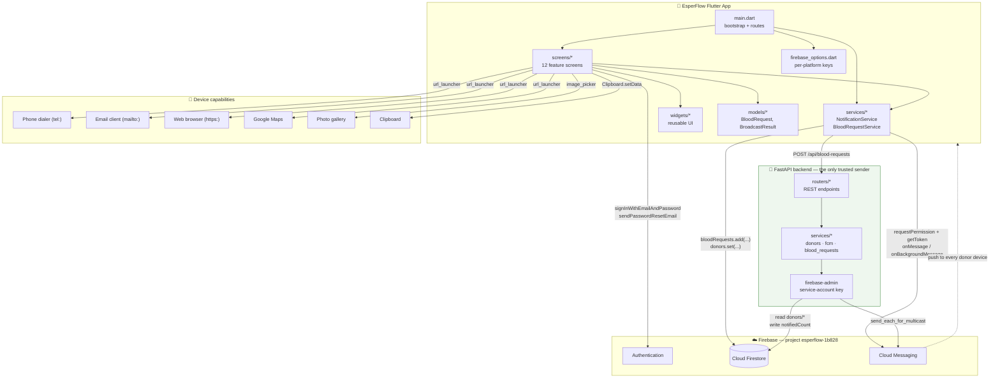
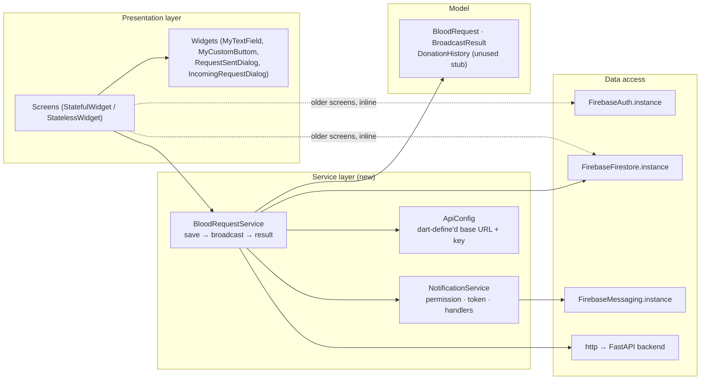
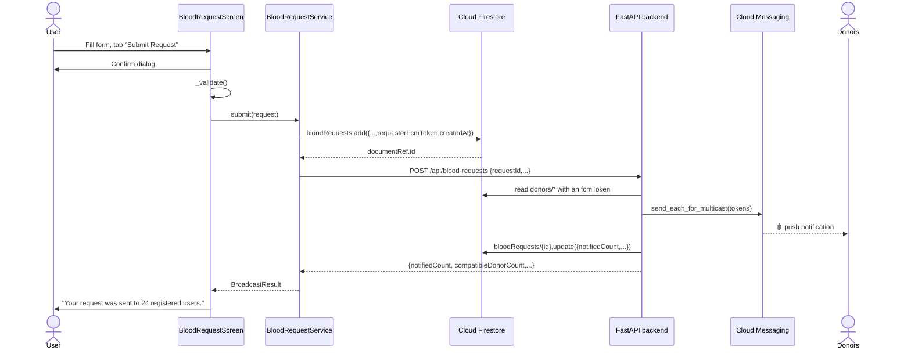
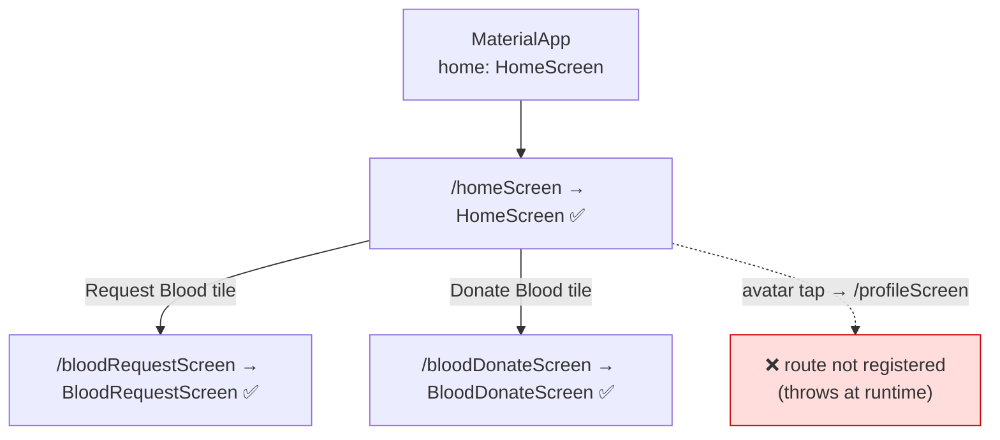
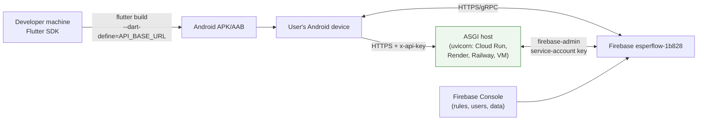

# Chapter 2 — Architecture

[← Introduction](01-introduction.md) · [Table of Contents](README.md) · [Next: Getting Started →](03-getting-started.md)

---

## 2.1 The big picture

EsperFlow is a **thick client with one trusted server**. Most logic still lives inside the Flutter app, which calls the Firebase SDKs directly from `State` classes; Firebase provides authentication, storage, and push transport. One capability, however, **cannot** live on the client: delivering a push notification to other people's devices requires Firebase Admin credentials, and shipping those in an app would hand every user the keys to the project. That single responsibility is why the [FastAPI backend](../backend/README.md) exists.

> **The rule that shapes this architecture:** the client may *write* a blood request; only the server may *broadcast* it.

**Key consequences of this design:**

1. **The app is still mostly self-enforcing.** Every path except the broadcast talks to Firebase directly, so correctness depends on the client code and on **Firestore Security Rules** ([`backend/firestore.rules`](../backend/firestore.rules), deployed from the console — see [Chapter 16](16-security.md)).
2. **The broadcast is the one server-validated path.** Its payload is re-validated by Pydantic, and the delivery counters (`notifiedCount`, `notifiedAt`) are written by the server only — the rules deny them to clients, so a request cannot lie about how many people it reached.
3. **The app degrades, it does not break.** If the backend is unreachable the request is still saved to Firestore; only the notification is deferred, and the UI offers a retry.

---

## 2.2 Layers inside the app

The app has a shallow, conventional Flutter structure. There is **no state-management library** (no Provider/Bloc/Riverpod) — an earlier Provider was explicitly removed (git commit `8ef7df9` "delete provider, it was not used"). All state is local `setState` inside `StatefulWidget`s.

The blood request feature introduced a **`services/` layer**; the older screens still call Firebase inline. Both patterns are currently in the tree.

| Layer | Where it lives | Notes |
|-------|----------------|-------|
| Presentation | [`lib/screens/`](../frontend/lib/screens/), [`lib/widgets/`](../frontend/lib/widgets/) | Screens own UI + orchestration; dialogs are extracted widgets |
| Services | [`lib/services/`](../frontend/lib/services/) | All I/O for the request feature: Firestore, HTTP, FCM |
| Config | [`lib/config/api_config.dart`](../frontend/lib/config/api_config.dart) | Backend URL and API key from `--dart-define`, never hard-coded |
| Data access | inline `FirebaseXxx.instance` calls | Still the pattern in Auth, Profile, Donate |
| Models | [`lib/models/`](../frontend/lib/models/) | `BloodRequest` / `BroadcastResult` are typed; older screens still pass untyped `Map`s |

> ⚠️ **Architectural debt (reduced, not gone):** the request feature now has a clean screen → service → I/O split, but Auth, Profile and Donate still interleave business logic, UI, and data access inside widget `State`. Migrating them to `services/` is the obvious next refactor. See [Chapter 15 §Recommendations](15-troubleshooting.md).

---

## 2.3 How a user request flows through the system

Most screens are still just a widget calling a Firebase SDK method. The exception — and the most complete flow in the system — is **submitting a blood request**, which crosses every tier:

Note where the work happens: the app decides *what* to send, the server decides *who* receives it. Full detail in [Chapter 6](06-blood-request-and-donation.md) and [Chapter 11](11-notifications.md).

---

## 2.4 Navigation architecture

Navigation uses Flutter's built-in **named-route table** declared in [`main.dart`](../frontend/lib/main.dart). The entry widget is `HomeScreen` (via `home:`), and only three named routes are registered.

The full route table, including every commented-out route, is in [Chapter 4 §Route table](04-app-entry-and-navigation.md#43-the-route-table) and the [Appendix](18-appendix.md#c-route-table).

---

## 2.5 Where the boundaries are

| Boundary | Crossed by | Protocol |
|----------|-----------|----------|
| App ↔ Firebase Auth | `firebase_auth` SDK | HTTPS to Google Identity Toolkit |
| App ↔ Firestore | `cloud_firestore` SDK | gRPC/HTTPS, real-time streams + one-shot reads |
| App ↔ FCM | `firebase_messaging` SDK | Token retrieval + push receipt (`onMessage`, `onBackgroundMessage`) |
| **App ↔ EsperFlow backend** | `http` package + [`ApiConfig`](../frontend/lib/config/api_config.dart) | **JSON over HTTP(S), `x-api-key` header** |
| **Backend ↔ Firestore / FCM** | `firebase-admin` (Python) | Service-account credentials, server-side only |
| App ↔ Phone/Email/Web/Maps | `url_launcher` | OS intent (`tel:`, `mailto:`, `https:`) |
| App ↔ Photo gallery | `image_picker` | OS picker intent |

The app-to-server boundary is **narrow by design**: exactly one endpoint is on the critical path (`POST /api/blood-requests`), and the app keeps working without it — a failed call leaves the request stored in Firestore with a retry available. Nothing else routes through the server, so it can be down without taking the app down.

The base URL and API key are injected at build time (`--dart-define=API_BASE_URL=…`), never hard-coded — see [Chapter 12](12-configuration-reference.md).

---

## 2.6 Deployment topology

Two deployable artefacts now: the Flutter binary and the FastAPI service. The binary must be built with the backend's public URL baked in via `--dart-define`, so **deploy the backend first, then build the app**. There is still no CI/CD configured in the repo. See [Chapter 14 — Deployment](14-deployment.md).

---

[← Introduction](01-introduction.md) · [Table of Contents](README.md) · [Next: Getting Started →](03-getting-started.md)
