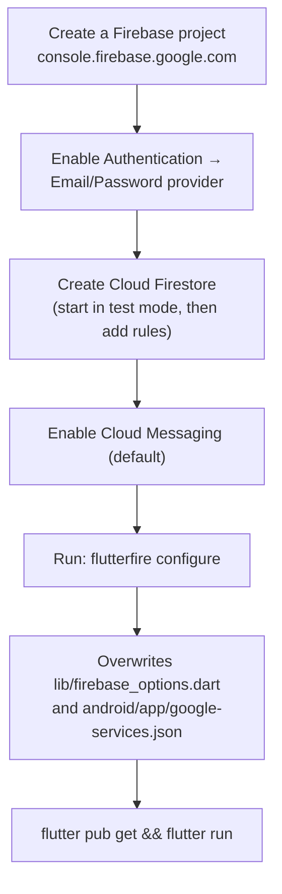

# Chapter 3 — Getting Started

[← Architecture](02-architecture.md) · [Table of Contents](README.md) · [Next: App Entry & Navigation →](04-app-entry-and-navigation.md)

---

This chapter takes you from a fresh machine to a running EsperFlow app.

## 3.1 Prerequisites

| Tool | Why | How to check |
|------|-----|--------------|
| **Flutter SDK** (stable) | Builds and runs the app. Dart `^3.10.0` is required, so use a recent Flutter stable release. | `flutter --version` |
| **Dart SDK** | Bundled with Flutter. | `dart --version` |
| **Android Studio** or **VS Code** | IDE + Android SDK, emulator, device tooling. | — |
| **Android SDK + an emulator or device** | Android is the primary target. | `flutter devices` |
| **Java 17** | The Android Gradle config targets `JavaVersion.VERSION_17`. | `java -version` |
| **Git** | Clone the repo. | `git --version` |
| **A Firebase project** | The app will not initialize without one. The repo already points at `esperflow-1b828`; to run your own, you create your own project (see §3.4). | — |
| **FlutterFire CLI** (optional) | Regenerates `firebase_options.dart` for your own project. | `dart pub global activate flutterfire_cli` |
| **Python 3.10+** | Runs the notification backend. Without it the app still saves requests, but no donor is ever notified. | `python --version` |
| **A Firebase service-account key** | The backend's credential for sending pushes. Downloaded from the console — never committed. | see §3.4 |

Run `flutter doctor` and resolve anything it flags before continuing.

> The `.metadata` file pins the project to Flutter stable revision `b45fa18946ecc2d9b4009952c636ba7e2ffbb787`. You don't have to match it exactly, but staying on a recent **stable** channel avoids SDK-constraint errors.

---

## 3.2 Project layout on disk

```
EsperFlow/
├── backend/          ← FastAPI notification server (Python)
│   ├── app/
│   │   ├── main.py        ← ASGI app + CORS + routers
│   │   ├── config.py      ← settings from .env
│   │   ├── firebase.py    ← Admin SDK bootstrap
│   │   ├── schemas.py     ← Pydantic request/response models
│   │   ├── blood_groups.py
│   │   ├── routers/       ← blood_requests.py, health.py
│   │   └── services/      ← donors.py, fcm.py, blood_requests.py
│   ├── firestore.rules    ← suggested security rules
│   ├── requirements.txt
│   └── .env.example       ← copy to .env
├── docs/             ← the older single-file project book
├── book/             ← THIS book
└── frontend/         ← the Flutter application
    ├── lib/          ← all Dart source
    │   ├── config/   ← api_config.dart (backend URL + key)
    │   ├── models/   ← blood_request.dart, donation_history.dart
    │   ├── screens/  ← 12 feature screens
    │   ├── services/ ← blood_request_service.dart, notification_service.dart
    │   └── widgets/  ← reusable UI + dialogs
    ├── android/      ← Android host project (customised)
    ├── ios/ web/ windows/ macos/ linux/  ← other platform hosts
    ├── assets/images/
    ├── test/
    ├── pubspec.yaml
    └── firebase.json
```

**Two things run:** the Flutter app in [`frontend/`](../frontend/) and the server in [`backend/`](../backend/README.md). A full annotated tree is in the [Appendix](18-appendix.md#a-file-index).

---

## 3.3 Install and run (fastest path)

```bash
# 1. Clone
git clone <your-repo-url> EsperFlow
cd EsperFlow/frontend

# 2. Fetch Dart/Flutter dependencies
flutter pub get

# 3. Check a device or emulator is available
flutter devices

# 4. Run in debug on the selected device (Android recommended)
flutter run
```

If you are using the **existing** `esperflow-1b828` Firebase project (its config is committed in the repo), the app should launch straight to the **Home** screen. That is expected — the app currently boots without a login (see [Chapter 1 §Honest snapshot](01-introduction.md#22-honest-snapshot-what-actually-works-today)).

### The backend

Notifications need the server running. In a **second terminal**:

```powershell
cd EsperFlow/backend
py -3 -m venv .venv                  # bash: python3 -m venv .venv
.\.venv\Scripts\Activate.ps1         # bash: source .venv/bin/activate
pip install -r requirements.txt
copy .env.example .env               # then drop serviceAccountKey.json here (§3.4)
uvicorn app.main:app --reload --host 0.0.0.0 --port 8000
```

Verify this before touching the app: <http://localhost:8000/ready> must report `"firebase": "connected"`. If it reports `degraded`, the service-account key is missing or unreadable and nothing will ever be delivered.

Then point the app at it:

```bash
flutter run --dart-define=API_BASE_URL=http://10.0.2.2:8000
```

`10.0.2.2` is how the **Android emulator** reaches your host machine's `localhost` — it is already the default in [`ApiConfig`](../frontend/lib/config/api_config.dart), so a plain `flutter run` works on an emulator. On a **physical phone**, pass your PC's LAN IP from `ipconfig` (e.g. `http://192.168.1.14:8000`) and keep the server on `--host 0.0.0.0`.

> ⚠️ **Expected runtime caveats:**
> - Tapping the person avatar on the Home screen navigates to `/profileScreen`, which is **not a registered route**, and will throw ([Chapter 4](04-app-entry-and-navigation.md)). The two working menu tiles are **Request Blood** and **Donate Blood**.
> - A request submitted when no *other* device has registered as a donor correctly reports **0 users notified** — you are excluded from your own broadcast. Register a donor on a second device or emulator to see a real count.

---

## 3.4 Setting up your **own** Firebase project

If you cannot or should not use the committed `esperflow-1b828` project, create your own. This is required for Auth, Firestore, and Messaging to work against a backend you control.



Step by step:

1. **Create a project** in the [Firebase console](https://console.firebase.google.com/).
2. **Enable Email/Password** under *Authentication → Sign-in method*. (The Login screen uses `signInWithEmailAndPassword`; without this provider, login fails.)
3. **Create a Cloud Firestore database.** Start in test mode for local development, then tighten rules before any real use — see [Chapter 16](16-security.md).
4. **Cloud Messaging** is enabled by default; no console step is strictly required to *capture* tokens.
5. **Generate a service-account key** for the backend: *Project settings → Service accounts → Generate new private key*. Save it as `backend/serviceAccountKey.json` (git-ignored) or paste its contents into `FIREBASE_SERVICE_ACCOUNT_JSON` in `backend/.env`, and set `FIREBASE_PROJECT_ID` to your project id. **This key is a full-access credential — it must never go into the app or into git** ([Chapter 16](16-security.md)).
6. **Regenerate config** from the `frontend/` directory:
   ```bash
   flutterfire configure
   ```
   This rewrites [`lib/firebase_options.dart`](../frontend/lib/firebase_options.dart) and [`android/app/google-services.json`](../frontend/android/app/google-services.json) with your project's keys.
7. `flutter pub get` then `flutter run`.

> The app's Firebase project and the backend's service-account key **must be the same project**. A key from a different project authenticates fine and then silently fails to deliver to your app's tokens — a genuinely confusing failure mode.

The full meaning of every field in `firebase_options.dart` is covered in [Chapter 12](12-configuration-reference.md).

---

## 3.5 Seeding data so screens have something to show

Several screens are static (Hospitals, Blood Banks, Emergency, FAQ, About) and need no data. The dynamic ones need Firestore documents:

| Screen | Needs | How to create it today |
|--------|-------|------------------------|
| **Donate Blood** | nothing pre-existing | Fill the form and submit — it creates a `donors/{uuid}` document. **Do this first:** it is what makes a device notifiable. |
| **Request Blood** | at least one *other* registered donor, plus the backend running | Fill the form and submit; the count in the confirmation dialog comes from the server. |
| **Profile** | a `User/{yourAuthUid}` document | ⚠️ No screen currently *creates* this. You must add it manually in the Firebase console, or finish the Register flow. Fields the screen reads are listed in [Chapter 10](10-data-and-storage.md). |
| **Donation History** | a `User/{uid}` doc + `User/{uid}/donations` subcollection | Use the on-screen **"Add Test Donation"** floating button (a dev helper) once a user is signed in. |

Because there is no auth gate, to exercise Profile/History you currently need to (a) create an auth user in the console, (b) create the matching `User/{uid}` doc, and (c) temporarily point the app at those screens (they aren't reachable through registered routes). This friction is itself part of the "unfinished wiring" story — see [Chapter 15](15-troubleshooting.md).

---

## 3.6 Your first build artifact

```bash
# From frontend/
flutter build apk            # debug-signed release APK (see caveat below)
flutter build appbundle      # Play Store bundle
```

> ⚠️ The release build type is currently **signed with the debug keystore** (`signingConfig = signingConfigs.getByName("debug")` in [`android/app/build.gradle.kts`](../frontend/android/app/build.gradle.kts)). That is fine for local testing but **not acceptable for Play Store distribution** — you must add a real signing config first. See [Chapter 14 — Deployment](14-deployment.md).

---

## 3.7 Quick command reference

| Command | Purpose |
|---------|---------|
| `flutter pub get` | Install dependencies |
| `flutter run` | Run in debug on a device/emulator |
| `flutter run --release` | Run an optimized build |
| `flutter analyze` | Static analysis / lint |
| `flutter test` | Run tests (⚠️ the default test currently fails — [Chapter 13](13-testing.md)) |
| `flutter build apk` | Build Android APK |
| `flutter clean` | Delete build artifacts when things get weird |
| `uvicorn app.main:app --reload` | Run the backend (from `backend/`, venv active) |
| `curl localhost:8000/ready` | Confirm the backend's Firebase credentials load |
| `curl localhost:8000/docs` | Interactive OpenAPI documentation |

The complete cheat sheet is in the [Appendix](18-appendix.md#d-cli--scripts-cheat-sheet).

---

[← Architecture](02-architecture.md) · [Table of Contents](README.md) · [Next: App Entry & Navigation →](04-app-entry-and-navigation.md)
