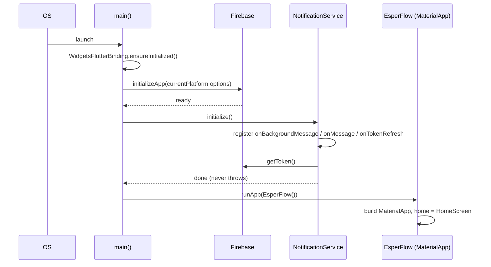
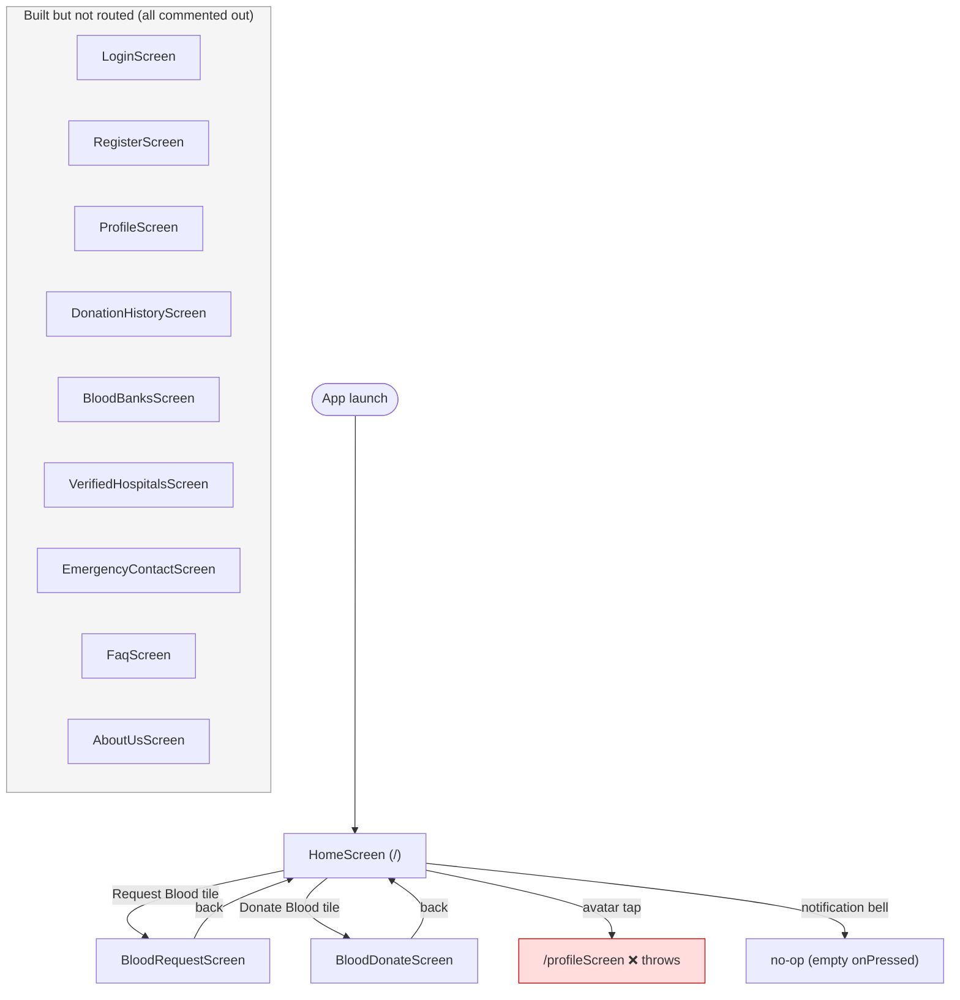
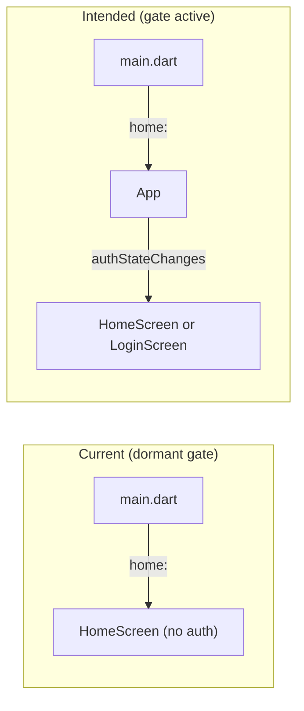

# Chapter 4 — App Entry & Navigation

[← Getting Started](03-getting-started.md) · [Table of Contents](README.md) · [Next: Authentication →](05-authentication.md)

---

This chapter covers how the app boots, what the root widget looks like, how routing is configured, and the theme. Files:
- [`lib/main.dart`](../frontend/lib/main.dart) — bootstrap + root widget + routes
- [`lib/app.dart`](../frontend/lib/app.dart) — a dormant authentication gate
- [`lib/firebase_options.dart`](../frontend/lib/firebase_options.dart) — per-platform Firebase keys (detailed in [Chapter 12](12-configuration-reference.md))

---

## 4.1 Bootstrap sequence (`main.dart`)

```dart
void main() async {
  WidgetsFlutterBinding.ensureInitialized();
  await Firebase.initializeApp(options: DefaultFirebaseOptions.currentPlatform);

  // Listens for blood requests broadcast by the backend and keeps this
  // device's FCM token current.
  await NotificationService.initialize();

  runApp(const EsperFlow());
}
```

Four things happen, in order:

1. **`WidgetsFlutterBinding.ensureInitialized()`** — required before any async work prior to `runApp`, because we `await` Firebase below. Without it, plugin channels aren't ready.
2. **`Firebase.initializeApp(...)`** — connects the app to the Firebase project. `DefaultFirebaseOptions.currentPlatform` picks the right keys for the platform the app is running on (Android/iOS/web/…). This is generated by the FlutterFire CLI.
3. **`NotificationService.initialize()`** — registers the background message handler, the foreground/tap listeners, and the token-refresh listener, then caches this device's FCM token. It must run **before** `runApp` so a notification that launched the app is not missed. See [Chapter 11 §11.2](11-notifications.md#112-the-receiving-half--notificationservice).
4. **`runApp(const EsperFlow())`** — mounts the root widget.



> ⚠️ There is still no error handling around `Firebase.initializeApp`. If initialization fails (bad config, no network at cold start), the exception is unhandled and the app fails to start. A production version should wrap this in a try/catch and show a fallback UI.
>
> `NotificationService.initialize()`, by contrast, **swallows its own errors by design** — a device that denies notification permission, or an iOS build without APNs configured, must still get a working app.

---

## 4.2 The root widget `EsperFlow`

```dart
class EsperFlow extends StatelessWidget {
  const EsperFlow({super.key});

  @override
  Widget build(BuildContext context) {
    return MaterialApp(
      debugShowCheckedModeBanner: false,
      // Lets an incoming push open a dialog without a BuildContext.
      navigatorKey: NotificationService.navigatorKey,
      theme: ThemeData(
        colorScheme: ColorScheme.fromSeed(seedColor: Colors.red),
      ),
      home: HomeScreen(),
      routes: { ... },
    );
  }
}
```

| Property | Value | Meaning |
|----------|-------|---------|
| `debugShowCheckedModeBanner` | `false` | Hides the "DEBUG" ribbon in the top-right during debug builds. |
| `navigatorKey` | `NotificationService.navigatorKey` | A push arrives from outside the widget tree, with no `BuildContext` to show a dialog with. This key gives `NotificationService` access to the `Navigator` so an incoming blood request can be displayed from anywhere. |
| `theme` | `ColorScheme.fromSeed(seedColor: Colors.red)` | **Material 3** theme derived from a red seed — the whole app's red palette flows from here. |
| `home` | `HomeScreen()` | The default (`/`) route. **This is why the app opens on Home with no login.** |
| `routes` | named-route table | See §4.3. |

Note there is **no `title:`** on the `MaterialApp` (the OS task title falls back to the Android `android:label="esperflow"`), and **no `initialRoute`** — `home:` takes that role.

---

<a id="43-the-route-table"></a>
## 4.3 The route table

The `routes` map registers named destinations for `Navigator.pushNamed(...)`. **Only three are active**; the rest are commented out in the source.

```dart
routes: {
  '/homeScreen': (context) => HomeScreen(),
  '/bloodRequestScreen': (context) => BloodRequestScreen(),
  '/bloodDonateScreen': (context) => BloodDonateScreen(),
  //'/loginScreen': (context) => LoginScreen(),
  //'/registerScreen': (context) => RegisterScreen(),
  //'/additionalInformationScreen': ...
  //'/faqScreen': ...
  //'/profileScreen': ...
  //'/emergencyContactScreen': ...
  //'/aboutUsScreen': ...
  //'/verifiedHospitalsScreen': ...
  //'/bloodBanksScreen': ...
  //'/donationHistoryScreen': ...
},
```

| Route | Target | Registered? | Reached from |
|-------|--------|:-----------:|--------------|
| `/` (implicit) | `HomeScreen` (via `home:`) | ✅ | app launch; profile sign-out `pushNamedAndRemoveUntil('/')` |
| `/homeScreen` | `HomeScreen` | ✅ | Profile bottom-nav "Home" |
| `/bloodRequestScreen` | `BloodRequestScreen` | ✅ | Home "Request Blood" tile |
| `/bloodDonateScreen` | `BloodDonateScreen` | ✅ | Home "Donate Blood" tile |
| `/profileScreen` | `ProfileScreen` | ❌ commented | Home avatar tap → **throws** |
| `/loginScreen` | `LoginScreen` | ❌ commented | — |
| `/registerScreen` | `RegisterScreen` | ❌ commented | Login "Register" link → **throws** |
| `/faqScreen` | `FaqScreen` | ❌ commented | — |
| `/emergencyContactScreen` | `EmergencyContactScreen` | ❌ commented | — |
| `/aboutUsScreen` | `AboutUsScreen` | ❌ commented | — |
| `/verifiedHospitalsScreen` | `VerifiedHospitalsScreen` | ❌ commented | — |
| `/bloodBanksScreen` | `BloodBanksScreen` | ❌ commented | — |
| `/donationHistoryScreen` | `DonationHistoryScreen` | ❌ commented | — |
| `/additionalInformationScreen` | (screen doesn't exist) | ❌ commented | — |
| `/chatBotScreen` | (screen doesn't exist) | ❌ commented | referenced in a commented Home tile |

> ⚠️ **The single most common runtime failure** in the current build: any `Navigator.pushNamed` to a commented route throws `Could not find a generator for route`. The live one users can hit is the **Home avatar → `/profileScreen`**. To restore full navigation you simply uncomment the routes (and confirm each screen's constructor). See [Chapter 15](15-troubleshooting.md).

Why comment them out? The git history (commit `253b8d8`: *"comment all other screens except blood request…"*) shows this was a deliberate step to isolate the two features under active development (Request/Donate) while the rest were parked.

---

## 4.4 Navigation map (what's actually reachable)



The eight screens in the grey box are fully implemented (Chapters [5](05-authentication.md), [7](07-profile-and-donation-history.md), [8](08-informational-screens.md)) but can't be opened through normal navigation until their routes and Home tiles are re-enabled.

---

## 4.5 The dormant auth gate (`app.dart`)

[`lib/app.dart`](../frontend/lib/app.dart) defines an `App` widget that would gate the whole app behind authentication:

```dart
class App extends StatelessWidget {
  @override
  Widget build(BuildContext context) {
    return Scaffold(
      body: StreamBuilder<User?>(
        stream: FirebaseAuth.instance.authStateChanges(),
        builder: (context, snapshot) {
          if (snapshot.hasData) {
            return HomeScreen();   // signed in
          } else {
            return LoginScreen();  // signed out
          }
        },
      ),
    );
  }
}
```

This is the **intended** entry point: listen to `authStateChanges()` and show `HomeScreen` when a user is signed in, `LoginScreen` otherwise. It is a clean, idiomatic Firebase auth gate.

**But it is not used.** In `main.dart` the import is commented (`//import 'package:esperflow/app.dart';`) and `home:` is set to `HomeScreen()` directly. So:



To turn authentication on, you would set `home: const App()` in `main.dart` and register the login/register routes. Doing so also makes `ProfileScreen`'s reliance on `FirebaseAuth.instance.currentUser` meaningful (today `currentUser` is usually `null`). See [Chapter 5](05-authentication.md) and [Chapter 16](16-security.md).

---

## 4.6 Theme & branding summary

- **Material 3**, red-seeded color scheme (global).
- Individual screens frequently hard-code `Colors.red.shadeXXX` and the brand accent `Color(0xFFE31A1A)` (a strong red) rather than pulling from the theme — so the palette is consistent but not centrally themed.
- Logo asset: [`assets/images/esperflow_logo.png`](../frontend/assets/images/esperflow_logo.png); Home footer: `home_screen_footer.png`. Asset registration lives in [`pubspec.yaml`](../frontend/pubspec.yaml) — see [Chapter 12](12-configuration-reference.md).

---

[← Getting Started](03-getting-started.md) · [Table of Contents](README.md) · [Next: Authentication →](05-authentication.md)
