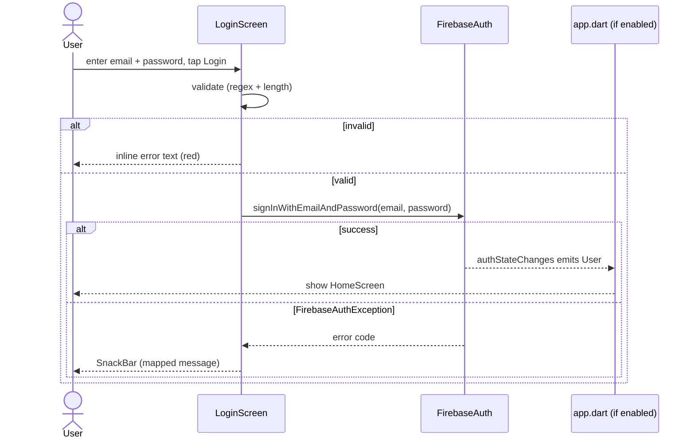
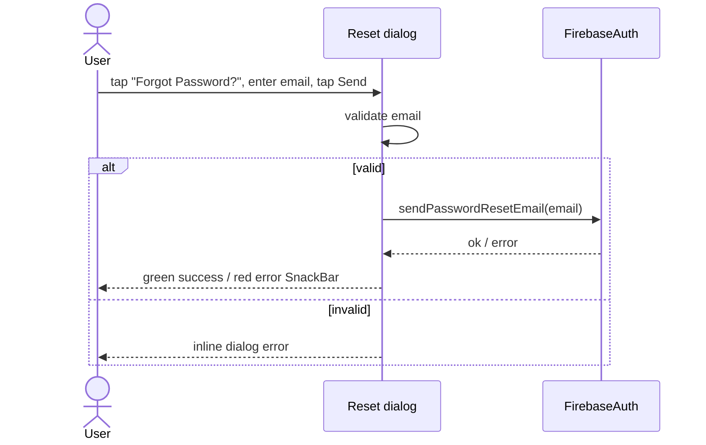
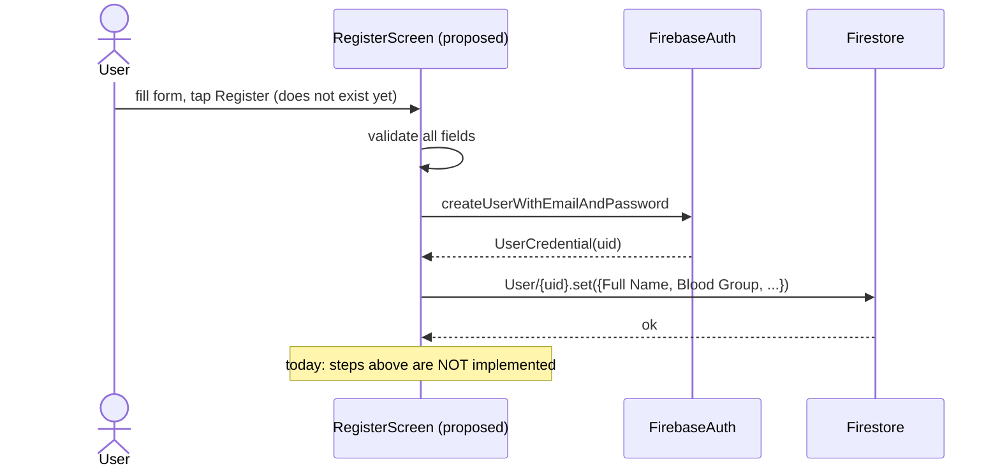
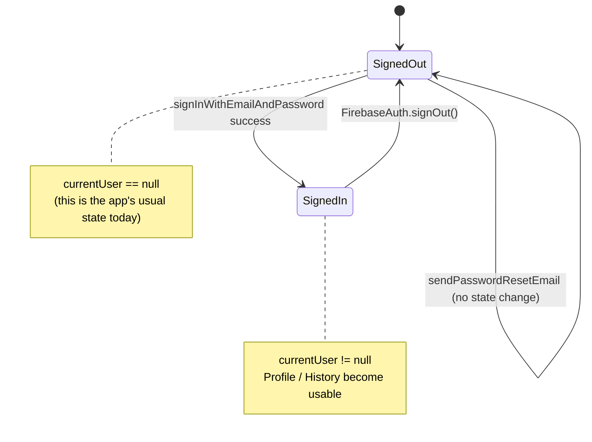

# Chapter 5 — Authentication

[← App Entry & Navigation](04-app-entry-and-navigation.md) · [Table of Contents](README.md) · [Next: Blood Request & Donation →](06-blood-request-and-donation.md)

---

Authentication in EsperFlow is **Firebase Authentication with email + password**. This chapter covers the two screens that implement it and the gate that would tie them together.

Files:
- [`lib/screens/login_screen.dart`](../frontend/lib/screens/login_screen.dart) — sign-in + password reset ✅ functional
- [`lib/screens/register_screen.dart`](../frontend/lib/screens/register_screen.dart) — ⚠️ UI only, no submit
- [`lib/app.dart`](../frontend/lib/app.dart) — the dormant auth gate (also see [Chapter 4 §4.5](04-app-entry-and-navigation.md#45-the-dormant-auth-gate-appdart))

> ⚠️ **Reachability:** neither screen is reachable in the running app because the auth gate is disabled and `/loginScreen` / `/registerScreen` are commented out of the route table. The Login *logic* nonetheless works if you route to it.

---

## 5.1 Login screen — behaviour

`LoginScreen` is a `StatefulWidget` with two controllers (`_emailController`, `_passwordController`) and two error strings (`_emailError`, `_passwordError`). It does three things:

1. **Client-side validation** before hitting Firebase.
2. **`signInWithEmailAndPassword`** with typed error handling.
3. A **"Forgot Password?"** dialog that calls `sendPasswordResetEmail`.

### The `signIn()` flow

```dart
Future<void> signIn() async {
  setState(() { _emailError = null; _passwordError = null; });
  final email = _emailController.text.trim();
  final password = _passwordController.text.trim();

  if (email.isEmpty) { setState(() => _emailError = 'Email is required'); return; }
  else if (!RegExp(r'^[\w-\.]+@([\w-]+\.)+[\w-]{2,4}$').hasMatch(email)) {
    setState(() => _emailError = 'Please enter a valid email address'); return;
  }
  if (password.isEmpty) { setState(() => _passwordError = 'Password is required'); return; }
  else if (password.length < 6) {
    setState(() => _passwordError = 'Password must be at least 6 characters'); return;
  }

  try {
    await FirebaseAuth.instance.signInWithEmailAndPassword(email: email, password: password);
  } on FirebaseAuthException catch (e) {
    // map e.code → friendly message, show SnackBar
  } catch (e) {
    // generic "unexpected error" SnackBar
  }
}
```

**Validation rules:**
- Email: non-empty **and** matches the regex `^[\w-\.]+@([\w-]+\.)+[\w-]{2,4}$`. (Note: this rejects TLDs longer than 4 characters, e.g. `.museum` — a minor limitation.)
- Password: non-empty **and** at least 6 characters.

**Firebase error mapping** (`FirebaseAuthException.code` → message shown in a red SnackBar):

| `e.code` | Message shown |
|----------|---------------|
| `user-not-found` | "No user found with this email" |
| `wrong-password` | "Incorrect password" |
| `invalid-credential` | "Invalid email or password" |
| `too-many-requests` | "Too many attempts. Please try again later" |
| `user-disabled` | "This account has been disabled" |
| *(any other)* | "Login failed" (default) |

On **success**, `signIn()` does nothing explicit — no navigation. That's intentional in the *intended* design: the [auth gate](04-app-entry-and-navigation.md#45-the-dormant-auth-gate-appdart) would react to `authStateChanges()` and swap to `HomeScreen`. Without the gate active, a successful login has no visible effect in the current build.



### The password-reset dialog

`showResetPasswordDialog(context)` opens an `AlertDialog` containing a `StatefulBuilder` (so the dialog can manage its own local error state). It validates the email with the same regex, then calls:

```dart
await FirebaseAuth.instance.sendPasswordResetEmail(email: email);
```

On success it pops the dialog and shows a green "Password reset email sent!" SnackBar; on failure a red "Error: …" SnackBar.



### UI composition
The screen uses the shared [`MyTextField`](09-widgets-and-models.md#91-mytextfield) (with `suffixIcon` and `obsecureFlag`) and [`MyCustomButtom`](09-widgets-and-models.md#92-mycustombuttom). Errors render as small red `Text` widgets under each field. The footer has an `esperflow_logo.png` and a **"Register"** text button that pushes `/registerScreen` — which is currently unregistered and would throw.

---

## 5.2 Register screen — behaviour (and the gap)

`RegisterScreen` collects five inputs — full name, email, password, phone, address — plus a **blood group** dropdown (`A+ … O-`). Each field has an associated `_xxxError` string and a `_clearErrorOnChange(field)` helper that clears the error as the user types.

```dart
final _fullNameController = TextEditingController();
final _emailController = TextEditingController();
final _passwordController = TextEditingController();
final _phoneNumberController = TextEditingController();
final _addressController = TextEditingController();
String? selectedBloodGroup;
// + _fullNameError, _emailError, _passwordError, _phoneNumberError, _bloodGroupError, _addressError
```

> ⚠️ **This screen is UI-only.** Read the `build` method end-to-end and you'll find:
> - **No submit button.** The last widget is a `SizedBox(height: 60)`.
> - **No `FirebaseAuth.createUserWithEmailAndPassword` call.**
> - **No Firestore write.**
> - The `_xxxError` fields are declared and *cleared* on change, but **never set**, because nothing validates or submits.
>
> In other words, registration currently cannot create an account or persist a profile. The git history (`601a31b` "update the register screen to have validation", `6eb242f` "successfully implemented the login and register functionality with firebase and firestore") indicates an earlier version *did* submit; the current file is a redesigned form whose submit/persistence logic has not been re-added.

**Why this matters downstream:** the [Profile](07-profile-and-donation-history.md) and [Donation History](07-profile-and-donation-history.md) screens read a `User/{uid}` document with fields like `Full Name`, `Blood Group`, `Current Address`, `CNIC Number`, `Health Issue`, `Last Blood Donation`. **Register is the screen that was supposed to create that document.** Because it doesn't, those screens have nothing to read unless the doc is created manually. This is the root of the "two identity models" issue in [Chapter 10](10-data-and-storage.md).

### What "finishing" Register looks like
To make it functional you would add a submit button whose handler:
1. Validates all fields (set the `_xxxError` strings on failure).
2. `createUserWithEmailAndPassword(email, password)`.
3. Write `User/{credential.user.uid}` with the Title-Case field names Profile expects.
4. Navigate (or let the auth gate do it).



---

## 5.3 The auth gate that ties it together

See [Chapter 4 §4.5](04-app-entry-and-navigation.md#45-the-dormant-auth-gate-appdart) for the full code. In short, [`app.dart`](../frontend/lib/app.dart)'s `App` widget uses a `StreamBuilder<User?>` on `FirebaseAuth.instance.authStateChanges()` to choose between `HomeScreen` (signed in) and `LoginScreen` (signed out). Enabling it (`home: const App()` in `main.dart`) is what makes the whole auth story cohere.

### Sign-out (implemented, in Profile)
The only place that ends a session is the Profile screen's **Sign Out** button:

```dart
await FirebaseAuth.instance.signOut();
if (context.mounted) {
  Navigator.pushNamedAndRemoveUntil(context, '/', (route) => false);
}
```

It signs out and clears the navigation stack back to `/` (Home). With the gate enabled, `/` → `App` → `LoginScreen`. With the gate disabled (today), `/` → `HomeScreen`. See [Chapter 7](07-profile-and-donation-history.md).

---

## 5.4 Auth state model



---

## 5.5 Summary of the auth module

| Capability | Status |
|-----------|--------|
| Email/password **sign-in** | ✅ Implemented with validation + error mapping |
| **Password reset** email | ✅ Implemented (dialog) |
| **Sign-out** | ✅ Implemented (Profile screen) |
| **Account creation (register)** | ⚠️ Not implemented (no submit/persistence) |
| **Auth gate** (route by auth state) | ⚠️ Written but disabled |
| **Reachability of login/register** | ⚠️ Routes commented out |

To ship a working auth experience you need three edits: enable the gate, register the routes, and re-add Register's submit + Firestore write.

---

[← App Entry & Navigation](04-app-entry-and-navigation.md) · [Table of Contents](README.md) · [Next: Blood Request & Donation →](06-blood-request-and-donation.md)
