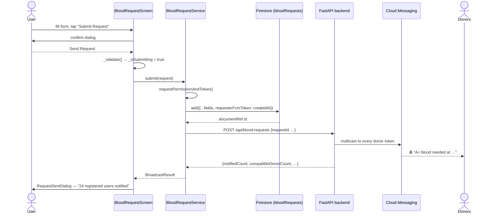
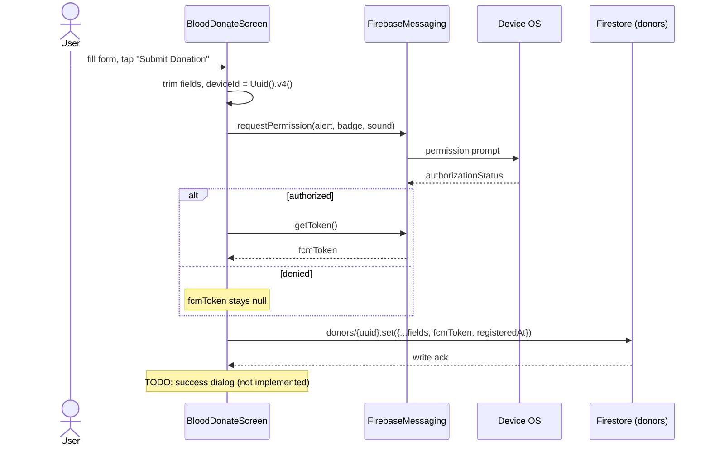

# Chapter 6 — Blood Request & Donation

[← Authentication](05-authentication.md) · [Table of Contents](README.md) · [Next: Profile & Donation History →](07-profile-and-donation-history.md)

---

These are the two **core** features of EsperFlow and the only feature routes left enabled (see [Chapter 4](04-app-entry-and-navigation.md#43-the-route-table)). They look almost identical in the UI, but Request is now the deeper of the two: it is the only flow that leaves the device *and* comes back with a server answer.

Files:
- [`lib/screens/blood_request_screen.dart`](../frontend/lib/screens/blood_request_screen.dart) — ✅ Firestore write + backend broadcast + donor count
- [`lib/screens/blood_donate_screen.dart`](../frontend/lib/screens/blood_donate_screen.dart) — ✅ Firestore write (donor registration + FCM token capture)

---

## 6.1 Blood Request screen

### Purpose
Let anyone post "I need blood": their name, optional phone, blood group, location, and an urgency flag. On submit the request is **saved to Firestore, pushed to every registered donor over FCM, and the requester is told how many people it reached.** The info card at the top warns *"Your request will be visible to all users in the app."*

### Fields & state
```dart
final _fullNameController    = TextEditingController();
final _locationController    = TextEditingController();
final _phoneNumberController = TextEditingController();

String? selectedBloodGroup;
List<String> bloodGroups = ['A+','A-','B+','B-','AB+','AB-','O+','O-'];
String? selectedUrgency = 'Not Urgent';   // radio: 'Urgent' / 'Not Urgent'
bool _isSubmitting = false;
```

- **Blood group** via a styled `DropdownButton`.
- **Urgency** via two `Radio<String>` widgets. The default is `'Not Urgent'`, which matches a radio value, so one option is selected from the start.
- Text fields reuse [`MyTextField`](09-widgets-and-models.md#91-mytextfield).

### The submit path

Tapping **Submit Request** no longer just flips a flag. It runs a five-step pipeline, split between the screen (orchestration + UI) and [`BloodRequestService`](../frontend/lib/services/blood_request_service.dart) (I/O):

```dart
// blood_request_screen.dart — the handler, abridged
onTap: _isSubmitting ? null : () async {
  if (await _confirmSubmission()) await saveBloodRequestData();
}

Future<void> saveBloodRequestData() async {
  if (_isSubmitting) return;                     // 1. re-entrancy guard
  final error = _validate();                     // 2. client-side validation
  if (error != null) { _showSnackBar(error); return; }

  setState(() => _isSubmitting = true);
  try {
    final result = await BloodRequestService.submit(request);   // 3 + 4
    _clearForm();
    await showDialog(                                           // 5. the count
      context: context,
      builder: (_) => RequestSentDialog(result: result),
    );
  } on BloodRequestException catch (e) {
    await _showFailureDialog(e);
  } finally {
    if (mounted) setState(() => _isSubmitting = false);         // always resets
  }
}
```

And inside the service:

```dart
// blood_request_service.dart
static Future<BroadcastResult> submit(BloodRequest request) async {
  // The requester's own token — the backend excludes it from the broadcast.
  final requesterToken = await NotificationService.requestPermissionAndToken();

  final documentRef = await _saveToFirestore(request, requesterToken);  // bloodRequests/{id}
  return _broadcast(request, documentRef.id, requesterToken);           // POST to the backend
}
```

| Step | What happens | Where |
|---|---|---|
| 1 | Confirm dialog — "sent to all users registered in the app" | `_confirmSubmission()` |
| 2 | Validation: name ≥ 2 chars, blood group selected, location ≥ 2 chars, phone (if given) ≥ 7 digits | `_validate()` |
| 3 | `bloodRequests/{id}.add({...fields, requesterFcmToken, createdAt})` | `BloodRequestService` |
| 4 | `POST /api/blood-requests` with the new document id | `BloodRequestService` |
| 5 | [`RequestSentDialog`](09-widgets-and-models.md#94-requestsentdialog) shows `notifiedCount` | the screen |



### What the requester sees

[`RequestSentDialog`](../frontend/lib/widgets/request_sent_dialog.dart) renders the numbers the backend returns:

- **`notifiedCount`** in large type — devices FCM accepted the push for. This is the headline "your request reached *N* people".
- **`compatibleDonorCount`** — how many of those can actually donate to the requested group (see [Chapter 11 §11.5](11-notifications.md#115-blood-group-compatibility)).
- **`failedCount`** — devices FCM rejected, shown small.
- If `notifiedCount` is 0 the dialog switches to an orange "Request saved" state: the data is safe, nobody was reachable yet.

### When the network fails

Firestore and the backend fail independently, and the screen distinguishes them via `BloodRequestException.savedToFirebase`:

| Failure | `savedToFirebase` | Dialog title | Recovery |
|---|---|---|---|
| Firestore write rejected | `false` | "Request failed" | Fix and resubmit — nothing was stored |
| Backend unreachable / timeout / 5xx | `true` | "Saved, but not sent" | **Try again** button calls `POST /api/blood-requests/{id}/notify`, which re-broadcasts the *already stored* request |

That split matters: once the document exists, the user must never be asked to retype the form. The retry path (`BloodRequestService.resend`) only re-runs the notification half.

---

## 6.2 Blood Donate screen

### Purpose
Register the current person as an available **donor**: name, optional phone, blood group, optional location, optional availability time, plus two privacy switches. This is the **only screen that writes a complete record to Firestore** and the only one that touches Cloud Messaging.

### Fields & state
```dart
final _fullNameController    = TextEditingController();
final _locationController     = TextEditingController();
final _phoneNumberController  = TextEditingController();
final _availabilityController = TextEditingController();

String? selectedBloodGroup;
bool allowCalls = true;          // "Users can call you"
bool activeDonorStatus = true;   // "Active Donors appear in search"
bool _isSubmitting = false;
```

Two `Switch` widgets control `allowCalls` and `activeDonorStatus` (styled with the brand red `Color(0xFFE31A1A)`).

### The submit path — the full write

Tapping **Submit Donation** runs this `async` handler (abridged):

```dart
fullName    = _fullNameController.text.trim();
location    = _locationController.text.trim();
phoneNumber = _phoneNumberController.text.trim();
availability= _availabilityController.text.trim();

// 1) A per-record unique id (NOT a user id)
String? deviceId = Uuid().v4();

// 2) Ask for notification permission and get an FCM token
final messaging = FirebaseMessaging.instance;
NotificationSettings settings =
    await messaging.requestPermission(alert: true, badge: true, sound: true);
String? fcmToken;
if (settings.authorizationStatus == AuthorizationStatus.authorized) {
  fcmToken = await messaging.getToken();
}

// 3) Write the donor document
await FirebaseFirestore.instance.collection('donors').doc(deviceId).set({
  'fullName': fullName,
  'location': location,
  'phoneNumber': phoneNumber,
  'availability': availability,
  'bloodGroup': selectedBloodGroup,
  'allowCalls': allowCalls,
  'activeDonorStatus': activeDonorStatus,
  'fcmToken': fcmToken,
  'registeredAt': FieldValue.serverTimestamp(),
});
// todo: Show success alert dialog
```

Step by step:

1. **`deviceId = Uuid().v4()`** — a fresh random UUID **per submission**. It's named `deviceId` but is not stable across submissions or tied to a device; every submit creates a new document. There is no Firebase Auth user involved.
2. **FCM permission + token** — prompts the OS, and if granted, retrieves the device's FCM registration token (used later to *push* to this donor). See [Chapter 11](11-notifications.md).
3. **Firestore write** — a `set` on `donors/{uuid}` with the fields above and a server timestamp.



### Known issues on this screen
> ⚠️ Several rough edges:
> - **No success/failure feedback.** The `// todo: Show success alert dialog` is never done, and the `set` isn't wrapped in try/catch — a failed write (e.g., permissions) throws silently to the console.
> - **`_isSubmitting` is never set here.** Unlike the button label logic implies, this handler doesn't toggle it, so the label stays "Submit Donation".
> - **No input validation.** Blank name or unselected blood group still writes (`bloodGroup` would be `null`).
> - **New document every submit.** Because the id is random, resubmitting creates duplicates rather than updating one donor record. The backend defends against this by de-duplicating on `fcmToken` before sending (newest registration wins), so a person who submitted five times is still notified once and counted once — but the duplicate documents remain.
> - **`_availabilityController` is not disposed** in `dispose()` (the other three are), a minor leak.

### The data it produces
A `donors` collection document — schema documented in [Chapter 10 §donors](10-data-and-storage.md#102-the-donors-collection).

---

## 6.3 Request vs. Donate — side by side

| Aspect | Blood **Request** | Blood **Donate** |
|--------|-------------------|------------------|
| Writes to DB? | ✅ `bloodRequests/{auto-id}` | ✅ `donors/{uuid}` |
| Uses FCM? | ✅ token capture + **triggers the broadcast** | ✅ permission + `getToken()` |
| Talks to the backend? | ✅ `POST /api/blood-requests` | ❌ No |
| Auth required? | No | No |
| Doc key | Firestore auto-id | random UUID (per submit) |
| Feedback on submit | ✅ confirm → count dialog → typed errors | none (TODO) |
| Validation | ✅ client + server (Pydantic) | none |
| Error handling | ✅ try/catch + retry path | none |
| Overall status | ✅ Complete | ✅ Functional (rough) |

The asymmetry has flipped. Request is now the reference implementation — validation, error typing, a service layer, and a server round trip — and Donate is the screen that should be brought up to it (success dialog, validation, a stable document key, `try/catch`).

> **Why Donate matters more than it looks:** it is the *only* place an FCM token is stored, so the `donors` collection defines who a broadcast can reach. A user who has only ever requested blood is not in it and will not be notified about anyone else's request. "Registered user" in this book always means "has a `donors` document with an `fcmToken`".

---

[← Authentication](05-authentication.md) · [Table of Contents](README.md) · [Next: Profile & Donation History →](07-profile-and-donation-history.md)
