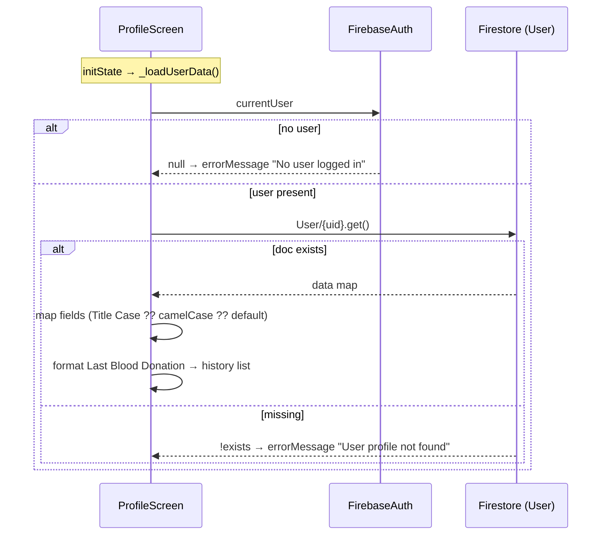
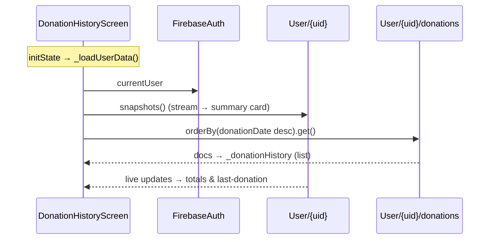
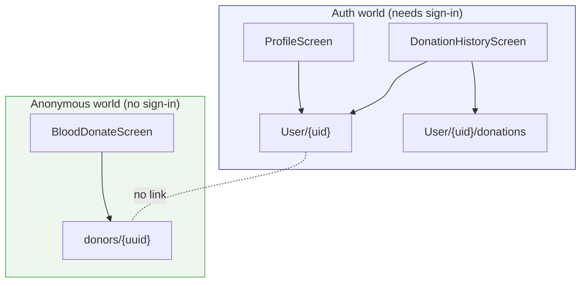

# Chapter 7 — Profile & Donation History

[← Blood Request & Donation](06-blood-request-and-donation.md) · [Table of Contents](README.md) · [Next: Informational Screens →](08-informational-screens.md)

---

These two screens are the **authenticated** side of the app: they read and write a `User/{uid}` document keyed by the Firebase Auth user ID. They are the counterpart to the donor flow in [Chapter 6](06-blood-request-and-donation.md), and the mismatch between the two is the subject of [Chapter 10](10-data-and-storage.md).

Files:
- [`lib/screens/profile_screen.dart`](../frontend/lib/screens/profile_screen.dart) — view/edit profile, avatar upload, sign-out
- [`lib/screens/donation_history_screen.dart`](../frontend/lib/screens/donation_history_screen.dart) — donation records from a subcollection

> ⚠️ **Precondition:** both screens assume `FirebaseAuth.instance.currentUser != null` **and** that a `User/{uid}` document already exists. Because the [auth gate is disabled](04-app-entry-and-navigation.md#45-the-dormant-auth-gate-appdart) and [Register never creates that doc](05-authentication.md#52-register-screen--behaviour-and-the-gap), you must create it manually (Firebase console) to exercise these screens today.

---

## 7.1 Profile screen

### Responsibilities
1. **Load** the current user's profile from `User/{uid}` on `initState`.
2. **Display** name, email, blood type, last donation, and an "Additional Information" card (phone, address, CNIC, health issue).
3. **Edit** name / phone / address / blood group inline and **save** back to Firestore.
4. **Upload** a profile picture (stored as base64 in Firestore).
5. **Sign out**.
6. A **bottom navigation bar** (Home / Profile) and a **debug button**.

### Loading data — `_loadUserData()`

```dart
final user = _auth.currentUser;
if (user == null) { errorMessage = 'No user logged in'; return; }

final userDoc = await _firestore.collection('User').doc(user.uid).get();
if (userDoc.exists) {
  final data = userDoc.data()!;
  userName      = data['Full Name']      ?? data['name']        ?? 'Not provided';
  userBloodType = data['Blood Group']    ?? data['bloodGroup']  ?? 'Unknown';
  userEmail     = user.email             ?? data['Email']       ?? 'Not provided';
  userPhone     = data['Phone Number']   ?? data['phoneNumber'] ?? 'Not provided';
  userAddress   = data['Current Address']?? data['address']     ?? 'Not provided';
  userCNIC      = data['CNIC Number']    ?? 'Not provided';
  // Health Issue: bool | 'true'/'yes' string | null
  // Last Blood Donation: parsed via _formatDateForDisplay()
}
```

Two things worth noting:

- **Defensive dual field names.** Every field is read as `data['Title Case'] ?? data['camelCase'] ?? default`. This is a tell that **two different write schemas existed over time** (Title Case with spaces vs. camelCase). Profile tolerates both. See [Chapter 10](10-data-and-storage.md).
- **Type-flexible `Health Issue`.** It may be a `bool`, a `String` (`'true'`/`'yes'`), or `null`, and the code normalises all three into a nullable `bool`.

`_formatDateForDisplay(String?)` tries `DateTime.parse` and returns `d/m/y`, falling back to the raw string. If `Last Blood Donation` is empty/null it shows "No donations yet" and the on-screen donation-history list stays empty.



### Editing — `_startEditing()` / `_updateUserProfile()`
Tapping **Edit Profile** copies current values into four controllers and flips `isEditing = true`, swapping labels for `TextField`s. **Save** calls:

```dart
await _firestore.collection('User').doc(user.uid).update({
  'Full Name': _nameController.text.isNotEmpty ? _nameController.text : userName,
  'Phone Number': ...,
  'Current Address': ...,
  'Blood Group': ...,
  'updatedAt': FieldValue.serverTimestamp(),
});
await _loadUserData();   // refresh
```

Note it uses **`update`** (not `set`), so **the document must already exist** or the call throws. Writes use the Title-Case field names (the canonical schema Profile expects).

### Profile picture — base64 in Firestore
`_pickAndUploadImage()` uses `image_picker` to pick a gallery image, then:

```dart
final bytes = await image.readAsBytes();
final base64Str = base64Encode(bytes);
await FirebaseFirestore.instance
    .collection('User').doc(user.uid)
    .update({'profilePicture': base64Str});
setState(() => profilePicBase64 = base64Str);
```

The image is decoded back with `MemoryImage(base64Decode(profilePicBase64!))` for display.

> ⚠️ **Design smell:** storing an image as a base64 string inside a Firestore document. Firestore documents have a **1 MiB size limit**, and base64 inflates bytes by ~33%. A moderately-sized photo can exceed the limit and the write fails. The idiomatic approach is **Firebase Storage** (upload the file, store only its download URL). This is a recommended refactor — see [Chapter 15](15-troubleshooting.md).

### Sign-out & navigation
- **Sign Out** → `FirebaseAuth.instance.signOut()` then `Navigator.pushNamedAndRemoveUntil(context, '/', (_) => false)`.
- **Bottom nav** → index 0 pushes `/homeScreen` (registered ✅). Index 1 is Profile itself.
- **Debug button** ("Debug: Check Firestore Data") fetches and dumps the raw `User/{uid}` document into a SnackBar + `print` — a development aid that should be removed before release.

### Sub-widget: `DonationHistoryTile`
Defined at the bottom of the same file — a `StatelessWidget` rendering a single donation as a `ListTile` with a blood-drop icon, title, date, and optional location. It's shifted left with `Transform.translate(offset: Offset(-16, 0))` to align with the card edge.

---

## 7.2 Donation History screen

### Responsibilities
Show a summary card (name, blood group, last donation, total count) plus a list of individual donation records, read from a **subcollection** `User/{uid}/donations`.

### Two reads working together
```dart
// (a) live stream of the user document (for the summary card)
_userStream = FirebaseFirestore.instance.collection('User').doc(uid).snapshots();

// (b) one-shot ordered read of the donations subcollection (for the list)
FirebaseFirestore.instance
  .collection('User').doc(uid).collection('donations')
  .orderBy('donationDate', descending: true)
  .get()
  .then((qs) => setState(() => _donationHistory = qs.docs.map(...).toList()));
```

- The **summary card** binds to a `StreamBuilder<DocumentSnapshot>` on `_userStream`, so it updates live if the `User` doc changes.
- The **list** is loaded once into `_donationHistory` (a `List<Map<String,dynamic>>`) and rendered with a `ListView.builder`.

Each donation renders its `donationDate` (via `_formatDate`, which handles both `Timestamp` and `String`), `location`, and a `verified` badge (✅ Verified / ⏳ Pending).



### The dev-only write: `_addTestDonation()`
A `FloatingActionButton` (labelled "Add Test Donation") writes a sample record so you can see the list populate:

```dart
await FirebaseFirestore.instance
  .collection('User').doc(uid).collection('donations')
  .add({
    'donationDate': Timestamp.now(),
    'location': 'Test Hospital',
    'verified': true,
    'addedOn': FieldValue.serverTimestamp(),
  });
```

> ⚠️ This is a **development helper** and the *only* code that creates `donations` records. There is no user-facing "record a donation" flow yet; a real one would live here or in the Donate flow. Remove/guard this button before release.

---

## 7.3 How the two identity worlds relate

Profile and History live entirely in the **`User/{uid}`** world (keyed by Auth UID). The Donate screen lives in the **`donors/{uuid}`** world (keyed by a random UUID, no auth). **Nothing bridges them.**



This split is examined fully in [Chapter 10 — Data & Storage](10-data-and-storage.md), which also proposes how to unify them.

---

[← Blood Request & Donation](06-blood-request-and-donation.md) · [Table of Contents](README.md) · [Next: Informational Screens →](08-informational-screens.md)
