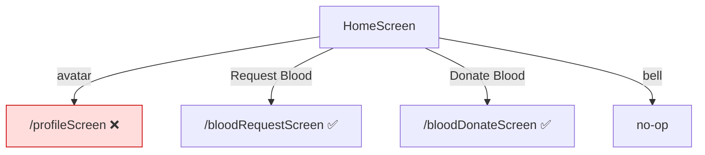
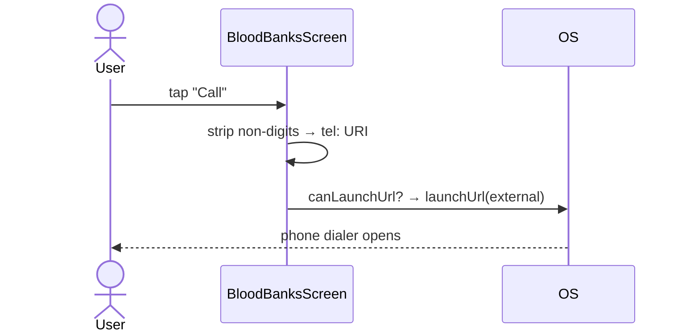
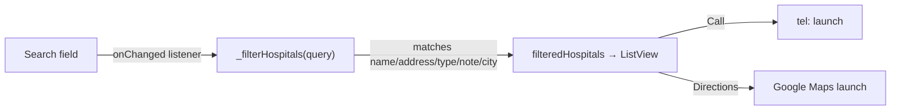
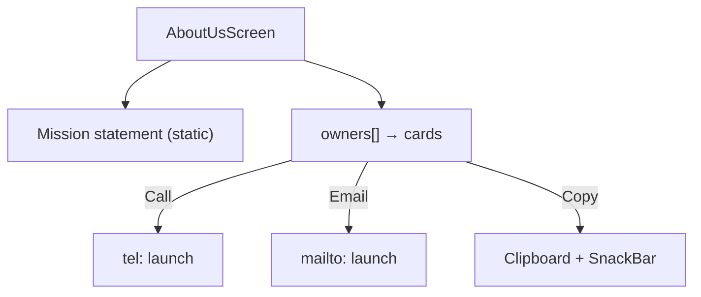

# Chapter 8 — Informational Screens

[← Profile & Donation History](07-profile-and-donation-history.md) · [Table of Contents](README.md) · [Next: Widgets & Models →](09-widgets-and-models.md)

---

These six screens are **read-only / static** — they contain hard-coded content (directories, helplines, FAQs) and integrate with the device (dialer, browser, maps, clipboard) but do **not** touch Firebase. They are the "reference" surface of the app.

| Screen | File | Data source | Device integration |
|--------|------|-------------|--------------------|
| Home | [`home_screen.dart`](../frontend/lib/screens/home_screen.dart) | none | navigation only |
| Blood Banks | [`blood_bank_screen.dart`](../frontend/lib/screens/blood_bank_screen.dart) | in-file list (8 orgs) | `url_launcher` (tel/web) |
| Verified Hospitals | [`verified_hospital_screen.dart`](../frontend/lib/screens/verified_hospital_screen.dart) | in-file list (21 hospitals) | `url_launcher` (tel/maps) |
| Emergency Contacts | [`emergency_contact_screen.dart`](../frontend/lib/screens/emergency_contact_screen.dart) | in-file list (8 contacts) | Clipboard |
| FAQ | [`faq_screen.dart`](../frontend/lib/screens/faq_screen.dart) | in-file Q&A (7) | none |
| About Us | [`about_us_screen.dart`](../frontend/lib/screens/about_us_screen.dart) | in-file team info | `url_launcher` + Clipboard |

> ⚠️ Except for **Home**, all of these are currently **unreachable** — their routes are commented out in `main.dart` ([Chapter 4](04-app-entry-and-navigation.md#43-the-route-table)). They are complete and would work as soon as their routes and Home tiles are re-enabled.

---

## 8.1 Home screen

The dashboard and app entry point ([why it's the entry](04-app-entry-and-navigation.md#42-the-root-widget-esperflow)).

**Structure:** a top row (profile avatar, centre logo, notification bell), a 2-column `GridView.count` of `MenuItemCard`s, and a footer image.

```dart
Row( ... avatar (→ /profileScreen), logo, bell (no-op) ... )
GridView.count(crossAxisCount: 2, childAspectRatio: 2, shrinkWrap: true, ...
  children: [
    MenuItemCard(text: 'Request Blood', onTap: → '/bloodRequestScreen'),
    MenuItemCard(text: 'Donate Blood',  onTap: → '/bloodDonateScreen'),
    // 8 more tiles commented out: Verified Hospitals, Blood Banks,
    // Donation History, FAQs, Emergency Contact, About Us, Chat Assistant
  ])
Image.asset('assets/images/home_screen_footer.png')
```

- **Active tiles:** only **Request Blood** and **Donate Blood**. The other eight tiles are commented out (matching the parked routes).
- **Avatar tap** → `Navigator.pushNamed('/profileScreen')` → ⚠️ **throws** (route not registered).
- **Bell** → empty `onPressed` (placeholder).
- `currentIndex` and a commented-out `BottomNavigationBar` hint at a planned bottom-nav that was disabled.
- Uses [`MenuItemCard`](09-widgets-and-models.md#93-menuitemcard).



---

## 8.2 Blood Banks & Organizations

A directory of **8 Pakistani blood-donation organizations** (Pakistan Red Crescent, Fatmid, Shaukat Khanum, Edhi, Chhipa, JDC, Punjab Blood Transfusion, Saylani), each a `Map` with `name`, `description`, `phone`, `website`, `icon`, `color`. Also a `quickTips` list (donate every 56 days, hydrate, iron-rich food, bring ID).

**Interactions** (via `url_launcher`, `LaunchMode.externalApplication`):
- **Call** → `_makeCall(phone)` builds a `tel:` URI after stripping non-digits with `RegExp(r'[^0-9+]')`.
- **Website** → `_openWebsite(url)` opens an `https:` URI in the external browser.
- `_formatPhoneNumber` prettifies numbers for display (`+92 xxx xxx xxxx`).

> ⚠️ `_showErrorSnackBar` only `print`s to console (comment: "For now, print to console") — launch failures are not surfaced to the user.



---

## 8.3 Verified Hospitals

A **searchable list of 21 Lahore hospitals** (name, address, phone, city, province, `mapsLink`, `type` = Public/Private/Military, `note`).

- **Search:** a `TextEditingController` with a listener calling `_filterHospitals(query)`, which filters `allHospitals` by name/address/type/note/city (case-insensitive) into `filteredHospitals`. A clear button resets it. Empty results show a friendly "No hospitals found" state.
- **Type badge:** `_hospitalTypeBadge` colours Public=green, Private=blue, Military=orange.
- **Actions:** **Call** (`tel:`) and **Directions** (opens the Google Maps `mapsLink`) via `url_launcher`.
- A footer shows "N hospitals found (21 total)".



---

## 8.4 Emergency Contacts

**8 emergency numbers** (Rescue 1122, Edhi 115, Police 15, hospitals, blood helplines), each with `name`, `number`, `description`, `icon`, and an optional `isCritical` flag. Critical contacts get a thicker red border and highlighted icon.

- **Interaction:** tapping a card **or** the copy icon calls `_copyToClipboard(number)` → `Clipboard.setData(...)` + a confirming SnackBar.
- ⚠️ Note: unlike the other screens, Emergency Contacts **copies** numbers rather than dialing them (no `url_launcher` here). A "call" action could be added for parity.
- A `FloatingActionButton.extended` ("Back to Home") pops the screen.

---

## 8.5 FAQ

A `StatelessWidget` with the logo, a title, and **7 hard-coded Q&A pairs** rendered via a small `QATile` widget (bold red "Q:", green "A:"). Topics: eligibility, frequency, volume, safety, duration, medication, cost.

> ⚠️ The last answer is truncated in the source: *"…we only…"* — an incomplete string to finish.

`QATile` is a reusable `StatelessWidget` local to this file (`question`, `answer` → a `Card` with two rows).

---

## 8.6 About Us

Mission statement + team section. The `owners` list currently has **one entry** (Abdul Hadi Jalil, CEO) with `name`, `position`, `phone`, `email`, `description`.

**Interactions** (via `url_launcher` + Clipboard):
- **Call** → `tel:` launch of the owner's phone.
- **Email** → `mailto:` launch.
- **Copy** → clipboard for phone/email, with a SnackBar.

The file opens with `// ignore_for_file: deprecated_member_use` because it uses `Color.withOpacity(...)`, which newer Flutter marks deprecated in favour of `.withValues(...)`.



---

## 8.7 Cross-cutting patterns in these screens

- **Data is embedded in the widget** (in-file `List<Map<...>>`). None of it comes from Firestore, so it can't be updated without shipping a new build. Migrating these lists to Firestore (or a bundled JSON asset) is a natural enhancement.
- **Consistent visual language:** red gradient backgrounds, `Colors.red.shadeXXX`, rounded cards — but colours are hard-coded rather than themed.
- **`url_launcher` is the shared device bridge** (tel/mailto/https/maps), guarded by `canLaunchUrl`. Error handling is uneven (some `print`, some silent).

---

[← Profile & Donation History](07-profile-and-donation-history.md) · [Table of Contents](README.md) · [Next: Widgets & Models →](09-widgets-and-models.md)
