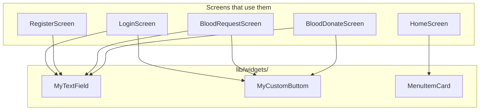
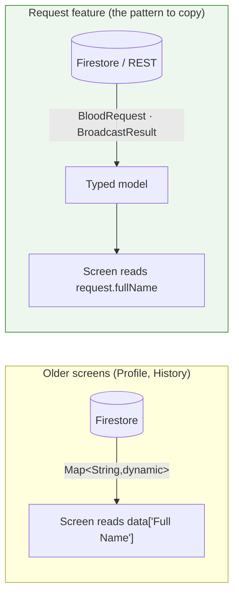

# Chapter 9 — Reusable Widgets & Data Models

[← Informational Screens](08-informational-screens.md) · [Table of Contents](README.md) · [Next: Data & Storage →](10-data-and-storage.md)

---

This chapter covers the shared building blocks in [`lib/widgets/`](../frontend/lib/widgets/) and the model stub in [`lib/models/`](../frontend/lib/models/). These are the small, reused pieces that keep the screens consistent.



---

<a id="91-mytextfield"></a>
## 9.1 `MyTextField` — [`my_text_field.dart`](../frontend/lib/widgets/my_text_field.dart)

The app's standard text input: a red-tinted, rounded `TextField` with an optional password-visibility toggle. It's a `StatefulWidget` because it manages its own obscure-text state.

### API
| Parameter | Type | Purpose |
|-----------|------|---------|
| `controller` | `TextEditingController` (required) | The field's controller |
| `hintText` | `String` (required) | Placeholder text |
| `obsecureFlag` | `bool` = `false` | If true, obscures text and shows a visibility toggle *(note: the name is misspelled "obsecure")* |
| `suffixIcon` | `IconData?` | Trailing icon (only when not a password field) |
| `labelText` | `String?` | Floating label |
| `keyboardType` | `TextInputType?` | e.g. phone, email |
| `onChanged` | `Function(String)?` | Change callback (used to clear errors) |
| `validator` | `String? Function(String?)?` | Declared but **unused** (no `Form`/`TextFormField`) |
| `onSuffixTap` | `VoidCallback?` | Extra callback when the visibility icon is tapped |

### Behaviour
- `_isObscured` is initialised from `obsecureFlag` in `initState`.
- When `obsecureFlag` is true, the suffix is an `IconButton` toggling `visibility` / `visibility_off`; otherwise it shows the optional `suffixIcon`.
- `maxLength: 120` with `counterText: ""` — caps input at 120 chars but hides the counter.
- Fill colour `Colors.red.shade50`, borderless `OutlineInputBorder` with radius 9.

> ⚠️ **Notes / gotchas:**
> - The `validator` parameter is accepted but never wired to anything — this is a plain `TextField`, not a `TextFormField`, so passing a validator does nothing. Screens do manual validation instead ([Chapter 5](05-authentication.md)).
> - The parameter name **`obsecureFlag`** is misspelled; keep it in mind when searching.

---

<a id="92-mycustombuttom"></a>
## 9.2 `MyCustomButtom` — [`my_custom_buttom.dart`](../frontend/lib/widgets/my_custom_buttom.dart)

The app's primary action button — a `GestureDetector` wrapping a coloured, rounded `Container` with centered bold text. Stateless.

### API
| Parameter | Type | Purpose |
|-----------|------|---------|
| `backgroundColor` | `Color` (required) | Button fill (usually `Color(0xFFE31A1A)`) |
| `text` | `String` (required) | Label |
| `textColor` | `Color?` | Text colour |
| `onTap` | `VoidCallback?` | Tap handler |

Used by Login ("Login"), Blood Request ("Submit Request"), and Blood Donate ("Submit Donation"). The file header comment says "used in login and register screens", though Register no longer uses it (it has no submit button — see [Chapter 5](05-authentication.md#52-register-screen--behaviour-and-the-gap)).

> ⚠️ Both the class name **`MyCustomButtom`** and the file name are misspelled ("Buttom" instead of "Button"). It's referenced by that spelling everywhere, so don't "fix" it without updating imports.

---

<a id="93-menuitemcard"></a>
## 9.3 `MenuItemCard` — [`menu_item_card.dart`](../frontend/lib/widgets/menu_item_card.dart)

A dashboard tile: a bordered, rounded `Container` with an icon and a bold label in a `Row`, wrapped in a `GestureDetector`. Stateless. Used only by the [Home screen grid](08-informational-screens.md#81-home-screen).

### API
| Parameter | Type | Purpose |
|-----------|------|---------|
| `iconData` | `IconData` (required) | Leading icon |
| `text` | `String` (required) | Tile label |
| `onTap` | `Function()?` | Tap handler (usually a `Navigator.pushNamed`) |

---

## 9.4 `RequestSentDialog` — [`request_sent_dialog.dart`](../frontend/lib/widgets/request_sent_dialog.dart)

The confirmation the requester sees after a successful broadcast — the screen that answers *"did anyone actually get this?"*.

### API

| Parameter | Type | Required | Purpose |
|-----------|------|:--------:|---------|
| `result` | `BroadcastResult` | ✅ | The counts returned by the backend |

### Behaviour

- Renders `result.notifiedCount` in 44pt brand red — the headline number.
- Adds a chip for `compatibleDonorCount` ("9 donors have a compatible blood group") when it is non-zero.
- Shows `failedCount` in small print when devices were unreachable.
- **Switches state when `notifiedCount == 0`:** the icon turns orange, the title becomes "Request saved" rather than "Request sent", and the server's `message` explains that nobody was reachable. Claiming success when zero people were notified would be the worst possible lie for this app to tell.
- Notes "This request had already been broadcast" when `alreadyNotified` is set (the idempotency path — see [Chapter 11](11-notifications.md)).

---

## 9.5 `IncomingRequestDialog` — [`incoming_request_dialog.dart`](../frontend/lib/widgets/incoming_request_dialog.dart)

The other side of the same feature: what a **donor** sees when a request push arrives.

### API

| Parameter | Type | Required | Purpose |
|-----------|------|:--------:|---------|
| `request` | `BloodRequest` | ✅ | Built from the push's `data` payload |

### Behaviour

- Title reads "Urgent: A+ blood needed" or "A+ blood needed" depending on `request.isUrgent`.
- Lists requester name, location, and phone as icon rows.
- Shows a **Call** button (`tel:` via `url_launcher`) only when a phone number was included, with a snackbar fallback if no dialer can be opened.
- Everything it renders comes from the notification payload, so it needs **no Firestore read** — it works on a bad connection.

Shown by `NotificationService` for foreground pushes, notification taps, and cold starts alike.

---

## 9.6 Widgets not extracted (inline)

Not every reusable-looking piece is a shared widget. Two notable **local** widgets live inside their screen files:

| Widget | Defined in | Role |
|--------|-----------|------|
| `DonationHistoryTile` | [`profile_screen.dart`](../frontend/lib/screens/profile_screen.dart) | Renders one donation row in Profile ([Chapter 7](07-profile-and-donation-history.md#71-profile-screen)) |
| `QATile` | [`faq_screen.dart`](../frontend/lib/screens/faq_screen.dart) | Renders one FAQ Q&A pair ([Chapter 8](08-informational-screens.md#85-faq)) |

If the app grows, these are candidates to move into `lib/widgets/`.

---

## 9.7 Data models — [`lib/models/`](../frontend/lib/models/)

Two files, at opposite ends of the quality scale.

### `blood_request.dart` — the typed models ✅

```dart
class BloodRequest {
  final String? id;
  final String fullName;
  final String bloodGroup;
  final String location;
  final String? phoneNumber;
  final String urgency;        // 'Urgent' | 'Not Urgent'
  final String? note;

  bool get isUrgent => urgency == 'Urgent';

  Map<String, dynamic> toFirestore();                       // → bloodRequests/{id}
  Map<String, dynamic> toJson({requestId, requesterFcmToken});  // → POST body
  factory BloodRequest.fromNotificationData(Map<String, dynamic> data);  // ← FCM payload
}
```

One class, three serialisations, each for a different boundary — and they are deliberately *not* identical: `toFirestore()` includes the denormalised `isUrgent` and `status` fields the database wants, while `toJson()` omits empty optionals so Pydantic's validators see `null` rather than `""`.

`BroadcastResult` is the read side, parsing the backend's answer:

```dart
class BroadcastResult {
  final int notifiedCount;          // devices FCM accepted
  final int totalRegisteredUsers;   // reachable devices
  final int compatibleDonorCount;   // of those, who can donate
  final int failedCount;
  final String requestId;
  final String message;
  final bool alreadyNotified;
}
```

Both parse defensively (`(json[key] as num?)?.toInt() ?? 0`) so a field the server stops sending degrades to zero instead of crashing the dialog.

### `donation_history.dart` — the stub ⚠️

```dart
class DonationHistory {
  String? donation;
}
```

> ⚠️ A single nullable field, **not imported anywhere**. The older screens still pass **untyped `Map<String, dynamic>`** values straight from Firestore into widgets (e.g., `_donationHistory` in [Donation History](07-profile-and-donation-history.md#72-donation-history-screen), `donationHistory` in Profile).

### The half-built model layer
Where models exist (the request feature) field names live in exactly one place. Where they do not:
- Field names are **string literals scattered across screens** (`data['Full Name']`, `data['Blood Group']`, `'donationDate'`, …), which is exactly how the [Title-Case vs. camelCase drift](10-data-and-storage.md) crept in.
- There is **no compile-time safety** against typos in field names.

**Recommended refactor:** finish what `BloodRequest` started — a `Donor` (for the `donors` collection) and an `AppUser` (for `User`), each with `fromMap`/`toMap`. This centralises field names and removes the dual-schema guessing in Profile. See [Chapter 15](15-troubleshooting.md).



---

[← Informational Screens](08-informational-screens.md) · [Table of Contents](README.md) · [Next: Data & Storage →](10-data-and-storage.md)
