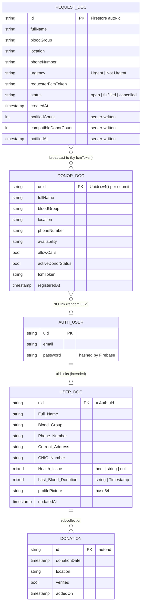
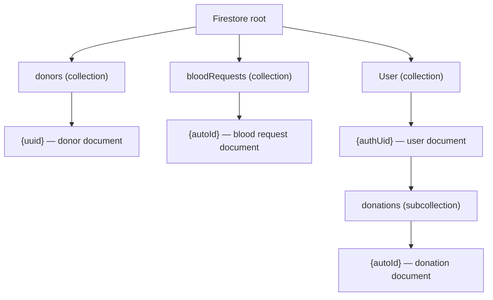
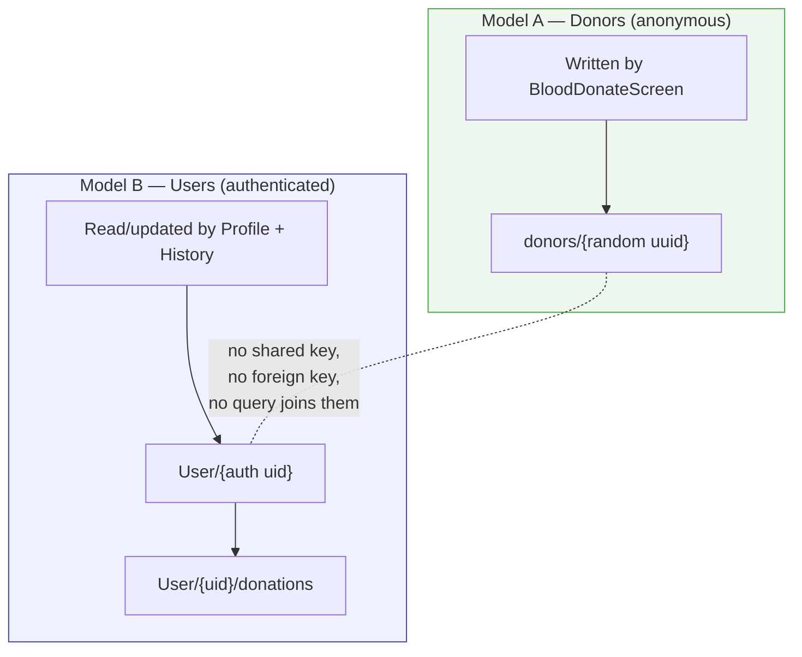

# Chapter 10 — Data & Storage

[← Widgets & Models](09-widgets-and-models.md) · [Table of Contents](README.md) · [Next: Notifications →](11-notifications.md)

---

EsperFlow stores data in **Cloud Firestore** (a NoSQL document database) and identities in **Firebase Authentication**. There is no relational database and no schema enforcement — Firestore is schemaless, so the "schema" below is inferred from the code that reads and writes it.

> There is **no migrations system, no ORM, and no seed script.** Documents come into existence when a screen writes them.

---

## 10.1 Firestore at a glance (ER-style diagram)

Firestore field names cannot contain spaces in this diagram, so `Full Name` is shown as `Full_Name`, etc. The **real** field keys are given exactly in the tables below.

---

## 10.2 The `donors` collection

**Written by:** [Blood Donate screen](06-blood-request-and-donation.md#62-blood-donate-screen) via `donors/{uuid}.set(...)`; `fcmToken` is also refreshed by [`NotificationService`](11-notifications.md#112-the-receiving-half--notificationservice) and cleared by the backend when FCM reports it dead.
**Read by:** the **backend**, on every broadcast — this collection *is* the notification audience ([`donors.fetch_audience()`](../backend/app/services/donors.py)). No screen queries it yet; a "find a donor" feature is still future work.
**Document ID:** a random `Uuid().v4()` generated per submission (not a user or device identity).

| Field | Type | Source | Notes |
|-------|------|--------|-------|
| `fullName` | string | form | trimmed |
| `location` | string | form | optional (may be `""`) |
| `phoneNumber` | string | form | optional |
| `availability` | string | form | free text, e.g. "evenings" |
| `bloodGroup` | string \| null | dropdown | `null` if not selected; drives `compatibleDonorCount` |
| `allowCalls` | bool | switch | default `true` |
| `activeDonorStatus` | bool | switch | default `true`; only honoured when `NOTIFY_ONLY_ACTIVE_DONORS=true` |
| `fcmToken` | string \| null | FCM | **the push address.** `null` ⇒ this donor cannot be notified. Deleted by the backend when FCM rejects it |
| `registeredAt` | Timestamp | server | `FieldValue.serverTimestamp()`; newest wins when one token appears in several documents |
| `tokenInvalidatedAt` | Timestamp | backend | only present on documents whose dead token was cleared |

Convention: **camelCase** keys.

> **This collection defines "registered user".** A person who has only ever *requested* blood has no document here and therefore receives no broadcasts. Registering as a donor is what puts you on the list.

---

## 10.3 The `bloodRequests` collection

**Written by:** the [Blood Request screen](06-blood-request-and-donation.md#61-blood-request-screen) via `BloodRequestService` (the request itself), then by the **backend** (the delivery counters).
**Read by:** the backend (`GET /api/blood-requests`, and each broadcast re-reads the document it is sending).
**Document ID:** a Firestore **auto-id** — unlike `donors`, one document per request, and the id is what the app hands to the backend.

| Field | Type | Written by | Notes |
|-------|------|-----------|-------|
| `fullName` | string | app | trimmed, ≥ 2 chars (validated both sides) |
| `bloodGroup` | string | app | one of the eight groups; server normalises `"a+"` → `"A+"` |
| `location` | string | app | city / area / hospital |
| `phoneNumber` | string \| null | app | optional; enables the **Call** button on recipients' devices |
| `urgency` | string | app | `"Urgent"` or `"Not Urgent"` |
| `isUrgent` | bool | app | denormalised for querying |
| `note` | string \| null | app | optional free text |
| `unitsNeeded` | int \| null | app | optional, 1–20 |
| `requesterFcmToken` | string \| null | app | excluded from the broadcast so you are not pushed your own request |
| `status` | string | app / backend | `open` → `fulfilled` \| `cancelled` \| `expired` |
| `createdAt` | Timestamp | app | `FieldValue.serverTimestamp()` |
| `notifiedCount` | int | **backend** | devices FCM accepted the push for |
| `failedCount` | int | **backend** | devices FCM rejected |
| `totalRegisteredUsers` | int | **backend** | reachable devices at broadcast time |
| `totalDonorProfiles` | int | **backend** | raw document count (higher, because of duplicates) |
| `compatibleDonorCount` | int | **backend** | of those notified, how many can donate to this group |
| `notificationStatus` | string | **backend** | `sent` \| `partial` \| `failed` \| `no_recipients` |
| `notifiedAt` | Timestamp | **backend** | **presence of this field means "already broadcast"** — the API returns stored counts instead of pushing twice |

> The two write groups are deliberately separated. [`firestore.rules`](../backend/firestore.rules) denies clients the counter fields, so `notifiedCount` can only ever be a number the server actually observed.

---

## 10.4 The `User` collection

**Written by:** [Profile screen](07-profile-and-donation-history.md#71-profile-screen) via `update(...)` (name/phone/address/blood group/`profilePicture`/`updatedAt`).
**Read by:** [Profile](07-profile-and-donation-history.md#71-profile-screen) and [Donation History](07-profile-and-donation-history.md#72-donation-history-screen).
**Document ID:** the Firebase Auth **`uid`**.

Fields the code reads (canonical **Title Case with spaces**, with camelCase fallbacks Profile also accepts):

| Canonical key | Fallback key | Type | Read by |
|---------------|--------------|------|---------|
| `Full Name` | `name` | string | Profile, History |
| `Blood Group` | `bloodGroup` | string | Profile, History |
| `Phone Number` | `phoneNumber` | string | Profile |
| `Current Address` | `address` | string | Profile |
| `CNIC Number` | — | string | Profile |
| `Health Issue` | — | bool \| string \| null | Profile |
| `Last Blood Donation` | — | string \| Timestamp | Profile, History |
| `Email` | — | string | Profile (falls back to `auth.email`) |
| `profilePicture` | — | string (base64) | Profile |
| `updatedAt` | — | Timestamp | written on edit |

> ⚠️ **Critical gap:** *no screen in the current codebase creates a `User` document.* [Register](05-authentication.md#52-register-screen--behaviour-and-the-gap) (which was meant to) has no submit/persist logic, and Profile only ever calls **`update`** (which requires the doc to already exist). So in a clean project, the `User` collection is empty and Profile shows "User profile not found in database" until you create the doc manually in the console.

### The `donations` subcollection
**Path:** `User/{uid}/donations/{autoId}`
**Written by:** the dev-only `_addTestDonation()` button in [Donation History](07-profile-and-donation-history.md#72-donation-history-screen).
**Read by:** Donation History (ordered by `donationDate` desc).

| Field | Type | Notes |
|-------|------|-------|
| `donationDate` | Timestamp | used for ordering + display |
| `location` | string | e.g. "Test Hospital" |
| `verified` | bool | ✅ Verified / ⏳ Pending badge |
| `addedOn` | Timestamp | `serverTimestamp()` |

---

## 10.5 The two-identity-model problem

This is the defining data issue in EsperFlow. There are **two parallel identity models** that never reference each other:

| | Model A: `donors` | Model B: `User` |
|--|-------------------|-----------------|
| Key | random UUID (per submit) | Firebase Auth UID |
| Requires sign-in? | No | Yes |
| Field convention | camelCase | Title Case (+ camelCase fallback) |
| Created by | Donate screen ✅ | *nothing* ⚠️ |
| Consumed by | *nothing yet* | Profile, History |
| Has FCM token? | Yes | No |

**Consequences:**
- A person who "donates" (Model A) and a person who "has a profile" (Model B) are **completely disconnected**. Donating doesn't populate your profile's history; your profile isn't discoverable as a donor.
- Duplicate donor records accumulate (new UUID each submit).
- The Title-Case/camelCase drift forces Profile's defensive `??` fallbacks.

**Recommended unification** (see also [Chapter 15](15-troubleshooting.md)):
1. Require sign-in (enable the [auth gate](04-app-entry-and-navigation.md#45-the-dormant-auth-gate-appdart)).
2. Key donor records by `auth.uid` instead of a random UUID (`donors/{uid}` or a `donor` field on `User/{uid}`).
3. Pick **one** field-naming convention and introduce typed models ([Chapter 9 §9.5](09-widgets-and-models.md#95-data-models--libmodels)).
4. Have Register create `User/{uid}`, and have a real "record donation" flow write to `User/{uid}/donations`.

---

## 10.6 Read/write matrix (who touches what)

| Actor | `donors` | `bloodRequests` | `User` | `User/*/donations` | Auth | FCM |
|--------|:-------:|:---------------:|:------:|:------------------:|:----:|:---:|
| Blood Donate | **write** | — | — | — | — | read token |
| Blood Request | — | **write** | — | — | — | read token |
| `NotificationService` | **update** (token refresh) | — | — | — | — | receive |
| **Backend** | read + **update** (clear dead tokens) | read + **update** (counters) | — | — | — | **send** |
| Profile | — | — | read + **update** | — | read/signOut | — |
| Donation History | — | — | read (stream) | read + **write*** | read | — |
| Login | — | — | — | — | **signIn/reset** | — |
| Register | — | — | — | — | — | — |
| Others (Home, Banks, Hospitals, Emergency, FAQ, About) | — | — | — | — | — | — |

*\* dev-only test button.*

---

## 10.7 The HTTP API

Most server interaction still goes through the Firebase SDKs (Auth, Firestore, Messaging) over Google's transport. On top of that, the app consumes **one small REST API of its own**, served by [`backend/`](../backend/README.md):

| Method | Path | Used by the app? |
|---|---|:--:|
| `POST` | `/api/blood-requests` | ✅ on every submit |
| `POST` | `/api/blood-requests/{id}/notify` | ✅ the "Try again" retry path |
| `GET` | `/api/blood-requests` | — available for a future request feed |
| `GET` | `/api/blood-requests/{id}` | — |
| `POST` | `/api/blood-requests/{id}/close` | — available for a "found a donor" action |
| `GET` | `/api/donors/reach` | — available for a pre-submit "N donors available" hint |
| `GET` | `/health`, `/ready` | — ops |

The wire format is **camelCase JSON** (matching the Firestore field names), request bodies are validated by Pydantic, and writes require an `x-api-key` header once `API_KEY` is configured. Full request/response schemas live in the [backend README](../backend/README.md#2-api) and, when the server is running, as interactive OpenAPI docs at `/docs`.

So the "API contract" of this project is now three things:
- the **Firestore document shapes** in this chapter,
- the **FCM payload contract** in [Chapter 11 §11.3](11-notifications.md#113-the-sending-half--the-backend), and
- the **REST endpoints** above.

---

[← Widgets & Models](09-widgets-and-models.md) · [Table of Contents](README.md) · [Next: Notifications →](11-notifications.md)
