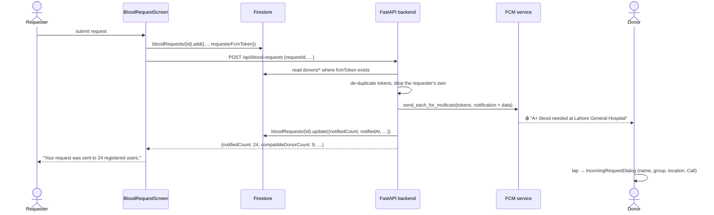

# Chapter 11 — Notifications (Firebase Cloud Messaging)

[← Data & Storage](10-data-and-storage.md) · [Table of Contents](README.md) · [Next: Configuration Reference →](12-configuration-reference.md)

---

Cloud Messaging is what makes EsperFlow more than a form: it is how a blood request reaches strangers' phones. The pipeline has two halves that must **never** live in the same place —

- the **receiving** half, in the Flutter app: ask permission, hold a token, react to a push;
- the **sending** half, in the [FastAPI backend](../backend/README.md): the only component allowed to hold Firebase Admin credentials.

Both halves are implemented. This chapter follows a notification from a tap on *Submit Request* to a tray notification on someone else's phone.

---

## 11.1 The full pipeline



| Piece | Status | Where it lives |
|---|:--:|---|
| Permission request | ✅ | `NotificationService.requestPermissionAndToken()` + `blood_donate_screen.dart` |
| Token retrieval & caching | ✅ | `NotificationService.initialize()` |
| Token storage | ✅ | `donors/{uuid}.fcmToken` |
| Token refresh listener | ✅ | `NotificationService._replaceStoredToken` |
| Foreground handler (`onMessage`) | ✅ | `NotificationService` → `IncomingRequestDialog` |
| Background handler (`onBackgroundMessage`) | ✅ | top-level `firebaseMessagingBackgroundHandler` |
| Tap-to-open (`onMessageOpenedApp`, `getInitialMessage`) | ✅ | `NotificationService` |
| **A server to send messages** | ✅ | [`backend/app/services/fcm.py`](../backend/app/services/fcm.py) |
| Android 13+ `POST_NOTIFICATIONS` | ✅ | `AndroidManifest.xml` |

---

## 11.2 The receiving half — `NotificationService`

[`lib/services/notification_service.dart`](../frontend/lib/services/notification_service.dart) is a static-only class wired up once from `main()`:

```dart
await Firebase.initializeApp(options: DefaultFirebaseOptions.currentPlatform);
await NotificationService.initialize();
```

`initialize()` never throws — it wraps everything in `try/catch`, because losing notifications must not stop the app from starting. It sets up five things:

```dart
FirebaseMessaging.onBackgroundMessage(firebaseMessagingBackgroundHandler);
await _messaging.setForegroundNotificationPresentationOptions(alert: true, badge: true, sound: true);
FirebaseMessaging.onMessage.listen(...);            // app in the foreground
FirebaseMessaging.onMessageOpenedApp.listen(...);   // tapped from the background
final initialMessage = await _messaging.getInitialMessage();  // tapped while terminated
_messaging.onTokenRefresh.listen(_replaceStoredToken);
_cachedToken = await _messaging.getToken();
```

### Showing a request without a `BuildContext`

A push arrives outside the widget tree, so there is no context to call `showDialog` with. The service owns a `navigatorKey` that `MaterialApp` installs:

```dart
// notification_service.dart
static final GlobalKey<NavigatorState> navigatorKey = GlobalKey<NavigatorState>();

// main.dart
MaterialApp(navigatorKey: NotificationService.navigatorKey, ...)
```

Any push whose `data['type'] == 'blood_request'` is turned into a [`BloodRequest`](09-widgets-and-models.md#96-bloodrequest--broadcastresult) and shown in an [`IncomingRequestDialog`](09-widgets-and-models.md#95-incomingrequestdialog) — requester name, blood group, location, and a **Call** button when a phone number was given.

### The background isolate

```dart
@pragma('vm:entry-point')
Future<void> firebaseMessagingBackgroundHandler(RemoteMessage message) async {
  await Firebase.initializeApp();
  ...
}
```

Three non-negotiable details: it must be a **top-level** function (not a method), it needs `@pragma('vm:entry-point')` so tree-shaking cannot remove it in release builds, and it must call `Firebase.initializeApp()` again — Flutter runs it in a **separate isolate** with none of your app's state. It deliberately does almost nothing: the tray notification is drawn by the OS from the `notification` block the backend sends.

### Token refresh

FCM tokens rotate — reinstall, restore to a new device, cleared app data. A stale token means the device silently drops off every future broadcast, which is the kind of bug nobody notices until it matters. So:

```dart
_messaging.onTokenRefresh.listen(_replaceStoredToken);
// → donors where fcmToken == previousToken → update to the new one
```

---

## 11.3 The sending half — the backend

Only [`backend/app/services/fcm.py`](../backend/app/services/fcm.py) can actually deliver a push, because only it has the service-account key. See the [backend README](../backend/README.md) for setup.

```python
message = messaging.MulticastMessage(
    tokens=chunk,                                     # ≤ 500 per call
    notification=messaging.Notification(title=title, body=body),
    data=data,                                        # all values must be strings
    android=android, apns=apns,
)
batch_response = messaging.send_each_for_multicast(message, dry_run=dry_run)
```

Four behaviours worth knowing:

1. **Batching.** FCM caps a multicast at 500 tokens; `broadcast_blood_request()` chunks and accumulates.
2. **Partial failure is normal.** A per-token failure is not an error for the request as a whole — the caller reports `notifiedCount` *and* `failedCount`, and the API still returns 201.
3. **Self-healing tokens.** Responses carrying `UnregisteredError`, `SenderIdMismatchError` or `InvalidArgumentError` mean the token is dead; those documents get their `fcmToken` deleted so the next broadcast is not slowed by them.
4. **Priority follows urgency.** Urgent requests go out with `apns-priority: 10` and a 1-hour TTL (a stale emergency helps nobody); normal ones get 24 hours.

### The payload

The `notification` block is what the OS renders; the `data` block is what the app reads.

```jsonc
{
  "notification": { "title": "🩸 URGENT: A+ blood needed",
                    "body":  "Ayesha Khan needs A+ blood at Lahore General Hospital. Tap to help." },
  "data": {
    "type": "blood_request",      // NotificationService dispatches on this
    "requestId": "0KJ2…",
    "fullName": "Ayesha Khan",
    "bloodGroup": "A+",
    "location": "Lahore General Hospital",
    "phoneNumber": "03001234567",
    "urgency": "Urgent",
    "click_action": "FLUTTER_NOTIFICATION_CLICK"
  }
}
```

Sending the details in `data` lets the tapped notification render a full dialog with **no extra Firestore read** — the phone may well be on a bad connection in an emergency.

> **On notification channels:** the Android config deliberately does *not* set a `channel_id`. On Android 8+ a notification addressed to a channel that was never created is silently dropped; by omitting it, FCM uses its own fallback channel, which the SDK guarantees exists. Adding `flutter_local_notifications` with a real channel would be the upgrade if you want a custom sound or importance.

---

## 11.4 Who gets notified

**Every registered user** — that is, every `donors/*` document that carries an `fcmToken` — not only blood-group matches. A rare group with no exact match still deserves to reach the widest audience, and someone who cannot donate can forward the request.

Two adjustments are applied before sending:

- **De-duplication.** The Donate screen writes a fresh `donors/{uuid}` on every submit, so one phone can appear many times. Tokens are collapsed to unique devices (newest registration wins for blood group), which is why `notifiedCount` counts **devices, not documents**.
- **Self-exclusion.** `requesterFcmToken` is dropped from the audience so you are never pushed your own request.

Set `NOTIFY_ONLY_ACTIVE_DONORS=true` in the backend `.env` to additionally skip donors who switched off *Active Donor Status*.

---

## 11.5 Blood group compatibility

Everyone is notified, but the requester is also told how many of those people could actually donate — `compatibleDonorCount`, from [`backend/app/blood_groups.py`](../backend/app/blood_groups.py):

| Recipient | Can receive from |
|---|---|
| A+ | A+, A−, O+, O− |
| A− | A−, O− |
| B+ | B+, B−, O+, O− |
| B− | B−, O− |
| AB+ | everyone (universal recipient) |
| AB− | AB−, A−, B−, O− |
| O+ | O+, O− |
| O− | O− (universal donor) |

`normalize()` also tolerates messy input — `"a+"`, `" O- "`, `"AB Positive"` all resolve — so a bad dropdown value never silently becomes an incompatible match.

---

## 11.6 Platform notes

- **Android:** `INTERNET` and, since Android 13, **`POST_NOTIFICATIONS`** are both declared in the manifest — without the latter the permission dialog never appears and pushes are dropped. `usesCleartextTraffic="true"` is what lets the app reach an `http://` dev backend; drop it once the backend is on HTTPS.
- **iOS/macOS:** requires APNs setup (Push Notifications capability + an APNs key uploaded to Firebase). Not configured in this repo, so pushes will not arrive on iOS until that is done — `getToken()` may also return null until an APNs token exists.
- **web/windows/linux:** FCM support varies; not a current target.

---

## 11.7 Testing notifications

1. Run the backend (`uvicorn app.main:app --reload`) and confirm `GET /ready` returns `"firebase": "connected"` — `"degraded"` means the service-account key is missing.
2. Register at least one donor on a **second** device or emulator (the requester is excluded from their own broadcast, so a single device will always report `notifiedCount: 0`).
3. Submit a request. Check the response count in the dialog, then `bloodRequests/{id}` in the console for `notifiedCount` / `notificationStatus`.
4. Use `POST /api/blood-requests?dryRun=true` to exercise the whole path through FCM validation **without** delivering anything.
5. Test all three receive states: app open (dialog), app backgrounded (tray → tap), app killed (tray → tap → `getInitialMessage`).

See [Chapter 15](15-troubleshooting.md) when a push does not arrive, [Chapter 12](12-configuration-reference.md) for the project wiring, and [Chapter 16](16-security.md) for why the sending side must stay on a trusted server.

---

[← Data & Storage](10-data-and-storage.md) · [Table of Contents](README.md) · [Next: Configuration Reference →](12-configuration-reference.md)
