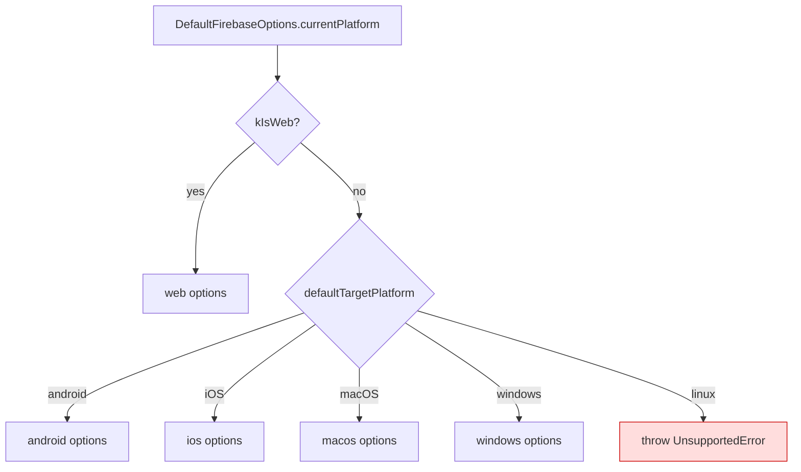

# Chapter 12 — Configuration Reference

[← Notifications](11-notifications.md) · [Table of Contents](README.md) · [Next: Testing →](13-testing.md)

---

This chapter is the exhaustive reference for every configuration file and option in the project. EsperFlow has **no `.env` file and no runtime environment variables** — configuration lives in Flutter/Firebase/Gradle config files that are compiled into the app. Where a value is a secret-by-convention (Firebase API keys), that's called out and explained in [Chapter 16](16-security.md).

---

## 12.1 `pubspec.yaml` — the project manifest

[`frontend/pubspec.yaml`](../frontend/pubspec.yaml) defines identity, dependencies, and assets.

| Key | Value | Meaning |
|-----|-------|---------|
| `name` | `esperflow` | Dart package name (used in imports: `package:esperflow/...`) |
| `description` | "A new Flutter project." | ⚠️ still the default template description |
| `publish_to` | `'none'` | Prevents accidental `pub publish` |
| `version` | `1.0.0+1` | `versionName`=1.0.0, `versionCode`=1 |
| `environment.sdk` | `^3.10.0` | Dart SDK constraint |

### Declared assets
```yaml
flutter:
  uses-material-design: true
  assets:
    - assets/images/esperflow_logo.png
    - assets/images/home_screen_footer.png
```
> ⚠️ [`assets/images/h.png`](../frontend/assets/images/h.png) exists on disk but is **not** declared here and is not referenced anywhere — an unused asset. Only the two files above are bundled.

Dependencies and their purposes are catalogued in the [Appendix §B](18-appendix.md#b-dependency-reference).

---

## 12.2 `firebase_options.dart` — per-platform Firebase keys

Generated by the FlutterFire CLI ([`lib/firebase_options.dart`](../frontend/lib/firebase_options.dart)). `DefaultFirebaseOptions.currentPlatform` returns the right `FirebaseOptions` at runtime by inspecting `defaultTargetPlatform` / `kIsWeb`.

| Platform | Configured? | App ID |
|----------|:-----------:|--------|
| web | ✅ | `1:272472365314:web:b60a8aef...` |
| android | ✅ | `1:272472365314:android:ea8517a7...` |
| iOS | ✅ | `1:272472365314:ios:147f9b65...` |
| macOS | ✅ (reuses iOS app) | same as iOS |
| windows | ✅ (reuses a web app) | `1:272472365314:web:23bfdebe...` |
| linux | ❌ | throws `UnsupportedError` |

Every platform shares:
- `projectId`: `esperflow-1b828`
- `messagingSenderId`: `272472365314`
- `storageBucket`: `esperflow-1b828.firebasestorage.app`

Each platform has its own `apiKey`, `appId`, and (web/windows) `authDomain` + `measurementId`.



> **On the exposed keys:** these Firebase `apiKey` values are **not secrets** in the traditional sense — client Firebase apps are designed to ship them, and access is controlled by Firebase Security Rules, not key secrecy. See [Chapter 16](16-security.md). That said, `google-services.json` and `firebase_options.dart` should still be treated per your org's policy.

---

## 12.3 `firebase.json` — FlutterFire tooling config

[`frontend/firebase.json`](../frontend/firebase.json) records how FlutterFire generated config (which app IDs map to which platform, and the output path for `google-services.json`). It's used by the CLI, not at runtime. It confirms the same `projectId` (`esperflow-1b828`) and per-platform app IDs listed above.

---

## 12.4 Android configuration

### `android/app/build.gradle.kts`
[File](../frontend/android/app/build.gradle.kts)

| Setting | Value | Notes |
|---------|-------|-------|
| Plugins | `com.android.application`, `com.google.gms.google-services`, `kotlin-android`, `dev.flutter.flutter-gradle-plugin` | Google Services plugin enables Firebase |
| `namespace` / `applicationId` | `com.example.esperflow` | ⚠️ default `com.example.*` — must change before publishing |
| `compileSdk` / `minSdk` / `targetSdk` | from Flutter defaults (`flutter.*`) | inherited |
| `sourceCompatibility` / `jvmTarget` | Java 17 | |
| Release `signingConfig` | **debug keystore** | ⚠️ "Signing with the debug keys for now" — not production-ready |

### `android/app/src/main/AndroidManifest.xml`
[File](../frontend/android/app/src/main/AndroidManifest.xml)

Permissions & intents relevant to app behaviour:

| Element | Purpose |
|---------|---------|
| `<uses-permission android:name="android.permission.INTERNET"/>` | Firebase + `url_launcher` network access |
| `android:usesCleartextTraffic="true"` | ⚠️ Allows plaintext HTTP — added to support `http://` links (e.g. Punjab Blood Transfusion site). A security consideration ([Chapter 16](16-security.md)). |
| `<queries>` for `PROCESS_TEXT`, `VIEW http/https`, `DIAL tel`, `CALL tel` | Required (Android 11+ package visibility) so `url_launcher` can resolve browser/dialer intents |
| `CALL_PHONE` permission | present but **commented out** (the app uses `DIAL`, which needs no runtime permission) |
| `android:label="esperflow"` | App name on the launcher |
| `flutterEmbedding` = `2` | Flutter v2 Android embedding |

`MainActivity.kt` is the stock `FlutterActivity` subclass (no custom native code):
```kotlin
package com.example.esperflow
import io.flutter.embedding.android.FlutterActivity
class MainActivity : FlutterActivity()
```

Other Android config files: [`android/build.gradle.kts`](../frontend/android/build.gradle.kts) (root), [`gradle.properties`](../frontend/android/gradle.properties), [`settings.gradle.kts`](../frontend/android/settings.gradle.kts), and generated [`google-services.json`](../frontend/android/app/google-services.json).

---

## 12.5 iOS / macOS / web / desktop config

These targets are scaffolded but not the focus of development:

| Platform | Key files | State |
|----------|-----------|-------|
| iOS | [`ios/Runner/Info.plist`](../frontend/ios/Runner/Info.plist), `AppDelegate.swift`, xcodeproj | Default scaffold; Firebase options exist; no APNs setup |
| macOS | [`macos/Runner/`](../frontend/macos/Runner/), entitlements | Default scaffold |
| web | [`web/index.html`](../frontend/web/index.html), [`web/manifest.json`](../frontend/web/manifest.json) | Default scaffold; Firebase web options exist |
| Windows | [`windows/runner/`](../frontend/windows/runner/) | Default scaffold; reuses a web Firebase app |
| Linux | [`linux/`](../frontend/linux/) | Scaffold present, but Firebase **not** configured (throws) |

---

## 12.6 Dart analyzer / lints

[`analysis_options.yaml`](../frontend/analysis_options.yaml) includes the standard Flutter lint set:
```yaml
include: package:flutter_lints/flutter.yaml
```
No custom rules are enabled or disabled — it's the default. Run it with `flutter analyze`. (Expect lints in the current code: `print` calls, `withOpacity` deprecation, etc.)

---

## 12.7 Editor / tooling config

| File | Purpose |
|------|---------|
| [`frontend/.vscode/settings.json`](../frontend/.vscode/settings.json) | VS Code workspace settings |
| [`frontend/.metadata`](../frontend/.metadata) | Flutter tool tracking (pinned SDK revision, per-platform migration state) |
| [`frontend/.gitignore`](../frontend/.gitignore) | Ignores build output, `.dart_tool`, etc. |
| [`frontend/pubspec.lock`](../frontend/pubspec.lock) | Locked dependency versions (see [Appendix §B](18-appendix.md#b-dependency-reference)) |
| [`.claude/settings.local.json`](../.claude/settings.local.json) | Claude Code local settings (not part of the app) |

---

## 12.8 Configuration summary

- **No environment variables / secrets manager.** All config is in-repo.
- **Single Firebase project** (`esperflow-1b828`) shared by all platforms and all developers.
- **Two production-blocking config items:** the `com.example.esperflow` application ID and the debug-key release signing (both in `build.gradle.kts`).
- **One security-relevant toggle:** `usesCleartextTraffic="true"`.

---

[← Notifications](11-notifications.md) · [Table of Contents](README.md) · [Next: Testing →](13-testing.md)
