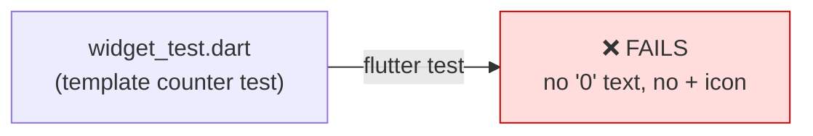
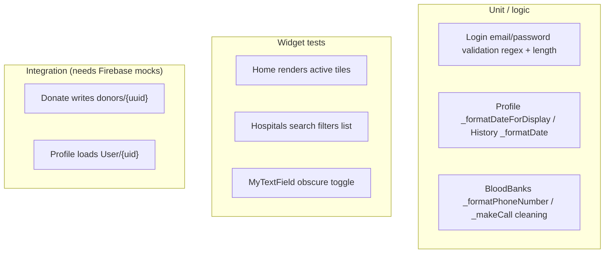

# Chapter 13 — Testing

[← Configuration Reference](12-configuration-reference.md) · [Table of Contents](README.md) · [Next: Deployment →](14-deployment.md)

---

## 13.1 Current state — one test, and it fails

The project contains a **single test file**, [`test/widget_test.dart`](../frontend/test/widget_test.dart), and it is the **unmodified default Flutter template test** — a counter smoke test:

```dart
testWidgets('Counter increments smoke test', (WidgetTester tester) async {
  await tester.pumpWidget(const EsperFlow());
  expect(find.text('0'), findsOneWidget);
  expect(find.text('1'), findsNothing);
  await tester.tap(find.byIcon(Icons.add));
  await tester.pump();
  expect(find.text('0'), findsNothing);
  expect(find.text('1'), findsOneWidget);
});
```

> ⚠️ **This test will fail.** EsperFlow is not a counter app — there is no `'0'` text and no `Icons.add` button on the Home screen. The test still references the template counter UI that this app never had. Worse, `pumpWidget(const EsperFlow())` builds the full `MaterialApp`, whose `HomeScreen` doesn't need Firebase to render, but the test's assertions (`find.text('0')`) fail immediately.

Running it:
```bash
cd frontend
flutter test
# ✗ Counter increments smoke test — Expected: exactly one matching node... Found: 0
```

So today's honest coverage is: **effectively zero, and the suite is red.**



---

## 13.2 How to run tests

| Command | What it does |
|---------|--------------|
| `flutter test` | Runs all tests in `test/` |
| `flutter test test/widget_test.dart` | Runs a single file |
| `flutter test --coverage` | Generates `coverage/lcov.info` |
| `flutter analyze` | Static analysis (not tests, but the first quality gate) |

There are also stock platform test stubs that are **not** part of `flutter test`:
- [`ios/RunnerTests/RunnerTests.swift`](../frontend/ios/RunnerTests/RunnerTests.swift)
- [`macos/RunnerTests/RunnerTests.swift`](../frontend/macos/RunnerTests/RunnerTests.swift)

These are default XCTest scaffolds and contain no meaningful assertions.

---

## 13.3 The immediate fix

Replace the counter test with one that actually reflects the app. A minimal, honest smoke test for the current build:

```dart
import 'package:flutter/material.dart';
import 'package:flutter_test/flutter_test.dart';
import 'package:esperflow/screens/home_screen.dart';

void main() {
  testWidgets('Home shows the two active menu tiles', (tester) async {
    await tester.pumpWidget(const MaterialApp(home: HomeScreen()));
    expect(find.text('Request Blood'), findsOneWidget);
    expect(find.text('Donate Blood'), findsOneWidget);
  });
}
```

Note this pumps `HomeScreen` directly inside a bare `MaterialApp` — **not** `const EsperFlow()` — so it avoids `Firebase.initializeApp` (which isn't called in widget tests and would otherwise need mocking). Testing screens that call Firebase requires mocking the SDKs (e.g. `firebase_auth_mocks`, `fake_cloud_firestore`), which are not currently dependencies.

---

## 13.4 What a real test strategy would cover

Given the architecture ([Chapter 2](02-architecture.md)), the highest-value tests to add:



| Priority | Test | Why it's tractable |
|----------|------|--------------------|
| High | Login validation (regex, length) | Pure logic, no Firebase — extract into a testable function |
| High | Hospitals search `_filterHospitals` | Pure list filtering |
| High | `MyTextField` obscure toggle | Local widget state, no backend |
| Medium | Home tile rendering / navigation | Widget test with a mock `NavigatorObserver` |
| Medium | Date/phone formatters | Pure functions currently buried in `State` classes |
| Lower | Donate/Profile Firestore paths | Needs `fake_cloud_firestore` + `firebase_auth_mocks` |

Much of the logic worth testing is **entangled inside `State` classes** (validation, formatting, filtering). Extracting it into free functions or a service layer ([Chapter 9 §9.5](09-widgets-and-models.md#95-data-models--libmodels)) is a prerequisite for good unit coverage.

---

## 13.5 Continuous integration

There is **no CI configuration** in the repository (no `.github/workflows`, no other pipeline). A first CI job would simply run, on every push:
```bash
flutter pub get
flutter analyze
flutter test
```
…which today would fail at `flutter test` until §13.3 is applied — a useful forcing function to fix the suite.

---

[← Configuration Reference](12-configuration-reference.md) · [Table of Contents](README.md) · [Next: Deployment →](14-deployment.md)
