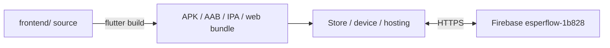
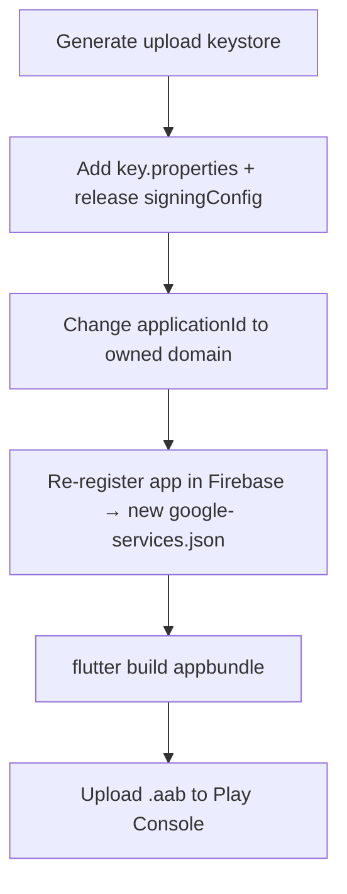
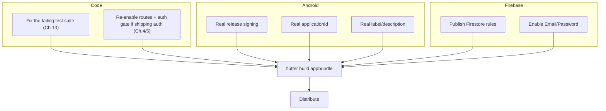

# Chapter 14 — Deployment

[← Testing](13-testing.md) · [Table of Contents](README.md) · [Next: Troubleshooting →](15-troubleshooting.md)

---

"Deployment" for EsperFlow means **building the Flutter app for a platform and distributing the binary.** There is no server to deploy — the only "backend" is the shared Firebase project, which is administered in the Firebase console, not from this repo.



---

## 14.1 Android (primary target)

### Build commands
```bash
cd frontend
flutter build apk            # single universal APK (sideload/testing)
flutter build apk --split-per-abi   # smaller per-architecture APKs
flutter build appbundle      # .aab for Google Play
```
Outputs land in `frontend/build/app/outputs/`.

### ⚠️ Blockers before a real Android release
The current Android config is **not production-ready**. Fix these first:

| Blocker | Where | Fix |
|---------|-------|-----|
| **Debug signing on release** | `android/app/build.gradle.kts` (`signingConfig = signingConfigs.getByName("debug")`) | Create a real keystore and a `release` signing config; never ship debug-signed to Play. |
| **Default application ID** | `applicationId = "com.example.esperflow"` | Change to a real, owned reverse-domain ID (e.g. `org.esperflow.app`). Changing it means re-registering the Android app in Firebase and regenerating `google-services.json`. |
| **Default app label / description** | manifest `android:label="esperflow"`, pubspec description | Set real product strings. |
| **Cleartext traffic enabled** | manifest `usesCleartextTraffic="true"` | Restrict to specific domains via a network security config, or drop if all links are HTTPS. |



---

## 14.2 iOS / macOS

```bash
flutter build ios       # requires macOS + Xcode
flutter build ipa       # archive for App Store / ad-hoc
flutter build macos
```
Additional requirements not yet configured here:
- An **Apple Developer account**, provisioning profiles, and a bundle ID (currently `com.example.esperflow`).
- **APNs** setup in Firebase for push (see [Chapter 11](11-notifications.md)).
- Update [`ios/Runner/Info.plist`](../frontend/ios/Runner/Info.plist) with real display name and any usage strings (e.g. photo library, since [`image_picker`](07-profile-and-donation-history.md#71-profile-screen) reads the gallery — iOS needs `NSPhotoLibraryUsageDescription`).

> ⚠️ `image_picker` on iOS will crash without the appropriate `Info.plist` usage descriptions. Add them before building for iOS.

---

## 14.3 Web

```bash
flutter build web        # outputs build/web/
```
The web build is a static site — deploy `build/web/` to any static host (Firebase Hosting is the natural choice given the existing project). Firebase **web** options are already present in `firebase_options.dart`. Note: this repo has no `firebase.json` *hosting* configuration; you'd run `firebase init hosting` to add it.

---

## 14.4 Windows / Linux desktop

```bash
flutter build windows    # outputs build/windows/
flutter build linux      # ⚠️ Firebase not configured for linux → will throw at init
```
- **Windows** reuses a web Firebase app and should initialise.
- **Linux** throws `UnsupportedError` in `DefaultFirebaseOptions.currentPlatform` ([Chapter 12](12-configuration-reference.md#122-firebase_optionsdart--per-platform-firebase-keys)); to support it you'd re-run `flutterfire configure` and add Linux.

---

## 14.5 Firebase-side "deployment"

The Firebase project is configured through the console, not this repo. Before real use you must publish, at minimum:
- **Authentication:** enable Email/Password.
- **Firestore Security Rules:** the app assumes rules exist; they are **not** in this repo. Ship restrictive rules ([Chapter 16](16-security.md)) before any public build — otherwise the database is world-readable/writable in test mode.
- **(Future) Cloud Functions** in `backend/` for the notification sender ([Chapter 11](11-notifications.md)).

---

## 14.6 Release checklist



There is no CI/CD in the repo ([Chapter 13 §13.5](13-testing.md#135-continuous-integration)); all builds are currently manual from a developer machine.

---

[← Testing](13-testing.md) · [Table of Contents](README.md) · [Next: Troubleshooting →](15-troubleshooting.md)
