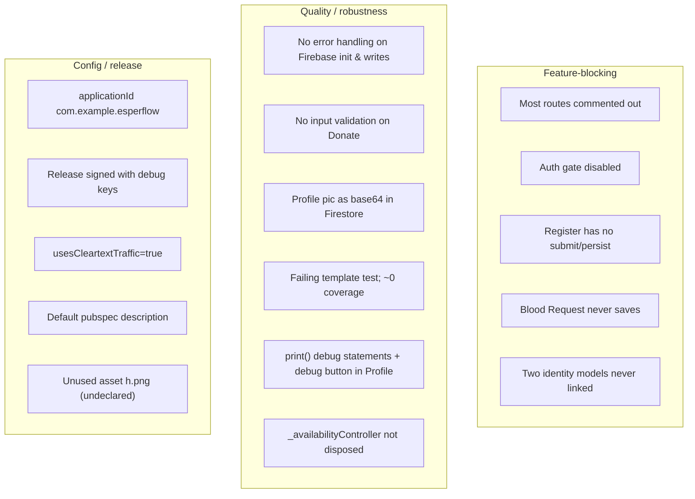

# Chapter 15 — Troubleshooting / FAQ

[← Deployment](14-deployment.md) · [Table of Contents](README.md) · [Next: Security →](16-security.md)

---

This chapter collects the problems a newcomer is most likely to hit, why they happen, and the fix — followed by a consolidated list of known issues and recommendations. Nearly all of them trace back to the "unfinished wiring" described in [Chapter 1 §Honest snapshot](01-introduction.md#22-honest-snapshot-what-actually-works-today).

---

## 15.1 Runtime problems

### "Could not find a generator for route `/profileScreen`" (app crashes on avatar tap)
**Cause:** the route is commented out in [`main.dart`](../frontend/lib/main.dart); only `/homeScreen`, `/bloodRequestScreen`, `/bloodDonateScreen` are registered ([Chapter 4](04-app-entry-and-navigation.md#43-the-route-table)).
**Fix:** uncomment the route(s) you need in the `routes:` map. The same applies to the Login screen's "Register" link (`/registerScreen`).

### The app opens on Home and never asks me to log in
**Cause:** by design today — `home: HomeScreen()` and the [auth gate is disabled](04-app-entry-and-navigation.md#45-the-dormant-auth-gate-appdart).
**Fix (if you want auth):** set `home: const App()` in `main.dart` and register `/loginScreen` + `/registerScreen`.

### Profile shows "User profile not found in database"
**Cause:** no `User/{uid}` document exists. Register doesn't create it, and Profile only `update`s ([Chapter 10 §10.3](10-data-and-storage.md#103-the-user-collection)).
**Fix:** create the doc manually in the Firebase console (collection `User`, document ID = the signed-in user's Auth UID, with the Title-Case fields), **or** finish the Register flow to create it ([Chapter 5](05-authentication.md#52-register-screen--behaviour-and-the-gap)).

### Profile shows "No user logged in"
**Cause:** `FirebaseAuth.instance.currentUser` is `null` because no one signed in (no auth gate, Login unreachable).
**Fix:** sign in first (route to Login, or create a user and enable the gate).

### I submitted a Blood **Request** but nothing was saved
**Cause:** not a bug you can find in Firestore — the screen never writes ([Chapter 6 §6.1](06-blood-request-and-donation.md#61-blood-request-screen)). `saveBloodRequestData()` only sets a flag.
**Fix:** implement a Firestore write (mirror the Donate screen).

### I submitted a Blood **Donation** but saw no confirmation
**Cause:** the write succeeds but there's no success dialog (`// todo`) and no try/catch ([Chapter 6 §6.2](06-blood-request-and-donation.md#62-blood-donate-screen)).
**Check:** look in Firestore → `donors` for a new document. **Fix:** add success/error UI and wrap the `set` in try/catch.

### Profile picture upload fails for larger images
**Cause:** the image is base64-encoded into the Firestore document, which has a **1 MiB limit** ([Chapter 7 §profile picture](07-profile-and-donation-history.md#71-profile-screen)).
**Fix:** migrate to Firebase Storage (upload file, store the download URL).

### `flutter test` fails
**Cause:** the default counter test doesn't match this app ([Chapter 13](13-testing.md#131-current-state--one-test-and-it-fails)).
**Fix:** replace it with a real test ([Chapter 13 §13.3](13-testing.md#133-the-immediate-fix)).

### Tapping a website/phone link does nothing
**Cause:** on Android 11+, `url_launcher` needs `<queries>` entries; they're present in the manifest. If you added a new scheme (e.g. `sms:`), add a matching `<queries>` intent. Also, launch failures are swallowed (`print` only) on some screens ([Chapter 8](08-informational-screens.md)).
**Fix:** add the intent to the manifest and surface errors in the UI.

### Build fails: Dart SDK version
**Cause:** `environment.sdk: ^3.10.0` requires a recent Flutter/Dart.
**Fix:** upgrade Flutter to a stable release satisfying Dart `^3.10.0`.

### Linux build/run throws `UnsupportedError`
**Cause:** Firebase options aren't configured for linux ([Chapter 12](12-configuration-reference.md#122-firebase_optionsdart--per-platform-firebase-keys)).
**Fix:** re-run `flutterfire configure` and add Linux, or don't target it.

---

## 15.2 Consolidated known issues & technical debt

| # | Issue | Severity | Chapter |
|---|-------|----------|---------|
| 1 | Only 3 routes registered; rest commented | High | [4](04-app-entry-and-navigation.md#43-the-route-table) |
| 2 | Auth gate written but unused | High | [4](04-app-entry-and-navigation.md#45-the-dormant-auth-gate-appdart) |
| 3 | Register has no submit / no Firestore write | High | [5](05-authentication.md#52-register-screen--behaviour-and-the-gap) |
| 4 | Blood Request doesn't persist | High | [6](06-blood-request-and-donation.md#61-blood-request-screen) |
| 5 | `donors` (uuid) vs `User` (uid) never linked | High | [10](10-data-and-storage.md#104-the-two-identity-model-problem) |
| 6 | No error handling around Firebase init & writes | Medium | [4](04-app-entry-and-navigation.md#41-bootstrap-sequence-maindart), [6](06-blood-request-and-donation.md#62-blood-donate-screen) |
| 7 | Base64 image in Firestore (1 MiB risk) | Medium | [7](07-profile-and-donation-history.md#71-profile-screen) |
| 8 | Failing/placeholder test suite | Medium | [13](13-testing.md) |
| 9 | Debug artifacts (`print`, debug button, test-donation FAB) | Low–Med | [7](07-profile-and-donation-history.md) |
| 10 | Release config not production-ready (app id, signing, cleartext) | Medium (release) | [12](12-configuration-reference.md#124-android-configuration), [14](14-deployment.md#141-android-primary-target) |
| 11 | No typed models; string-literal field names | Medium | [9](09-widgets-and-models.md#95-data-models--libmodels) |
| 12 | Misspellings baked into API (`obsecureFlag`, `MyCustomButtom`) | Low | [9](09-widgets-and-models.md) |
| 13 | Truncated FAQ answer; unused `h.png`; default description | Low | [8](08-informational-screens.md#85-faq), [12](12-configuration-reference.md) |

---

## 15.3 Recommended order of work

If you're picking this up to make it a working product, this sequence unblocks the most with the least risk:

```mermaid
graph LR
    S1["1. Fix the test suite (green CI)"] --> S2["2. Enable auth gate + register routes"]
    S2 --> S3["3. Finish Register → create User/{uid}"]
    S3 --> S4["4. Unify identity: key donors by uid"]
    S4 --> S5["5. Make Blood Request persist"]
    S5 --> S6["6. Build the notification sender (backend/)"]
    S6 --> S7["7. Harden: validation, error UI, Storage for images"]
    S7 --> S8["8. Production config: app id, signing, Firestore rules"]
```

1. **Green the test suite** so every later change is guarded ([Chapter 13](13-testing.md#133-the-immediate-fix)).
2. **Turn on authentication** ([Chapter 4](04-app-entry-and-navigation.md#45-the-dormant-auth-gate-appdart), [Chapter 5](05-authentication.md)).
3. **Finish Register** to create the `User` document Profile needs ([Chapter 10](10-data-and-storage.md#103-the-user-collection)).
4. **Unify the identity models** — key donor records by `uid` ([Chapter 10 §10.4](10-data-and-storage.md#104-the-two-identity-model-problem)).
5. **Persist Blood Request** ([Chapter 6](06-blood-request-and-donation.md#61-blood-request-screen)).
6. **Build the notification sender** so captured FCM tokens are actually used ([Chapter 11](11-notifications.md)).
7. **Harden**: validation, error handling, Firebase Storage for images, remove debug code.
8. **Production config + Firestore rules** ([Chapter 12](12-configuration-reference.md), [Chapter 14](14-deployment.md), [Chapter 16](16-security.md)).

---

[← Deployment](14-deployment.md) · [Table of Contents](README.md) · [Next: Security →](16-security.md)
