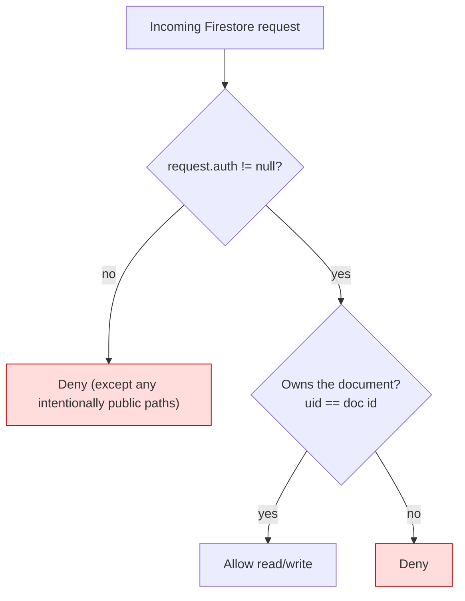
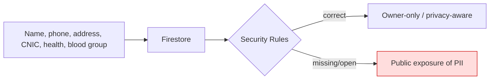
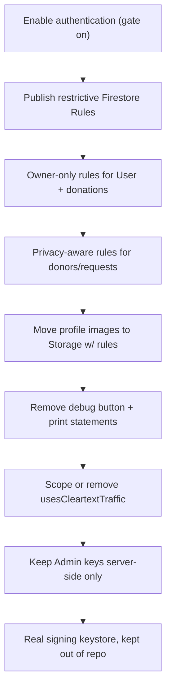

# Chapter 16 — Security Considerations

[← Troubleshooting](15-troubleshooting.md) · [Table of Contents](README.md) · [Next: Glossary →](17-glossary.md)

---

Because EsperFlow is a **client-only app talking directly to Firebase** ([Chapter 2](02-architecture.md)), its security posture is defined almost entirely by **Firebase configuration** — especially Firestore Security Rules — not by server code. This chapter maps the sensitive areas and what must be true before this app is exposed to real users.

---

## 16.1 Authentication

- **Mechanism:** Firebase Authentication, email + password ([Chapter 5](05-authentication.md)).
- **Password policy in-app:** minimum 6 characters (client-side only). Firebase enforces its own minimums server-side.
- **Password reset:** via `sendPasswordResetEmail` (secure, Firebase-hosted flow).
- **Session:** managed by the Firebase SDK; `authStateChanges()` is the source of truth.

> ⚠️ **The app currently runs unauthenticated.** The [auth gate is disabled](04-app-entry-and-navigation.md#45-the-dormant-auth-gate-appdart) and Login is unreachable, so in practice `currentUser` is `null`. Any Firestore access therefore happens as an **unauthenticated** client — which makes the Security Rules (below) the *only* thing standing between the public and the database.

---

## 16.2 Firestore Security Rules — the critical control

**The repository contains no Firestore rules.** They live in the Firebase console and are not version-controlled here. This is the highest-priority security item.

- If the database was left in **test mode**, the default rules allow open read/write to anyone with the project's (shipped) API key — i.e. the world can read and write `donors`, `User`, and everything else.
- The Donate flow writes `donors/{uuid}` **without authentication**, so rules must permit anonymous creates for that collection *if* you keep the anonymous model — which is itself a risk (spam/abuse).

**Minimum recommended posture:**

Concretely, once identities are unified ([Chapter 10 §10.4](10-data-and-storage.md#104-the-two-identity-model-problem)):
- `User/{uid}` and its `donations` subcollection: readable/writable only when `request.auth.uid == uid`.
- Donor records: require auth; validate field types and sizes; rate-limit creates to curb spam.
- Deny everything not explicitly allowed.

> **Action item:** author, review, and **publish restrictive rules before any public build** ([Chapter 14 §14.5](14-deployment.md#145-firebase-side-deployment)). Consider committing the rules file to the repo so it's reviewable.

---

## 16.3 Secrets & keys

| "Secret" | In repo? | Is it actually secret? |
|----------|:--------:|------------------------|
| Firebase `apiKey` (per platform) in [`firebase_options.dart`](../frontend/lib/firebase_options.dart) | ✅ | **No** — Firebase client API keys are meant to ship in the app. They identify the project; they don't grant privileged access. Access control is via Security Rules, not key secrecy. |
| [`google-services.json`](../frontend/android/app/google-services.json) | ✅ | Same as above — client config, not a credential. |
| Firebase **Admin** service-account key | ❌ (correctly absent) | **Yes, extremely** — would grant full backend access. Must **never** be embedded in the app; belongs only on a trusted server ([Chapter 11](11-notifications.md)). |
| Signing keystore | ❌ | Yes — keep the release keystore out of the repo ([Chapter 14](14-deployment.md#141-android-primary-target)). |

**Takeaway:** the committed Firebase keys are not a leak, but they are also *not* a security boundary. Do not rely on them being private; rely on Rules. And never add an Admin/service-account key to the client.

---

## 16.4 Network & transport

- All Firebase traffic is over **HTTPS/TLS** by the SDK.
- ⚠️ **`usesCleartextTraffic="true"`** in the [Android manifest](../frontend/android/app/src/main/AndroidManifest.xml) globally permits plaintext HTTP. It was added so `http://` external links (e.g. a government site) open. This weakens the app's network posture app-wide.
  **Fix:** replace with a scoped **network security config** that allows cleartext only for the specific domains that need it, or ensure all launched links are HTTPS and remove the flag.

---

## 16.5 Sensitive data handling

EsperFlow handles **personal and health-adjacent data**: full names, phone numbers, home addresses, **CNIC** (national ID) numbers, blood groups, and **health-issue** flags. This is sensitive PII.

Current concerns:
- **Broadcast-by-design intent.** Both feature screens warn "visible to all users in the app." If Security Rules make `donors`/requests broadly readable, phone numbers and locations of donors become public. Model the privacy switches (`allowCalls`, `activeDonorStatus`) into the rules and queries so users' preferences are actually enforced, not just stored.
- **CNIC & health status** in `User/{uid}` must be locked to the owner.
- **Profile pictures** stored as base64 in the user doc inherit whatever read rules apply to that doc — another reason to move images to Storage with their own access rules ([Chapter 7](07-profile-and-donation-history.md#71-profile-screen)).
- **Debug leakage.** The Profile "Debug: Check Firestore Data" button and multiple `print` statements dump user data to logs/SnackBars ([Chapter 7](07-profile-and-donation-history.md#71-profile-screen)). Remove before release.

---

## 16.6 Abuse & integrity

- **Anonymous donor creation** (`donors/{uuid}` with no auth) invites spam and fake records; each submit also creates a *new* document ([Chapter 6](06-blood-request-and-donation.md#62-blood-donate-screen)). Mitigate with auth-gated creates, validation in rules, and dedup by `uid`.
- **No server-side validation.** Since there's no backend, malformed/malicious writes are only stopped by Security Rules — write them to validate types, required fields, and value ranges.
- **FCM tokens** are device push addresses; keep them readable only to the trusted sender, not to all clients.

---

## 16.7 Security checklist (pre-release)

| Item | Status today |
|------|--------------|
| Authentication enforced | ❌ gate disabled |
| Firestore rules restrictive | ❌ not in repo / unknown |
| PII owner-scoped | ❌ depends on rules |
| Images in Storage (not base64) | ❌ base64 in Firestore |
| Debug data-dump removed | ❌ present |
| Cleartext traffic scoped | ❌ globally enabled |
| Admin creds absent from client | ✅ (none present) |
| Client Firebase keys understood as non-secret | ✅ (informational) |

---

[← Troubleshooting](15-troubleshooting.md) · [Table of Contents](README.md) · [Next: Glossary →](17-glossary.md)
