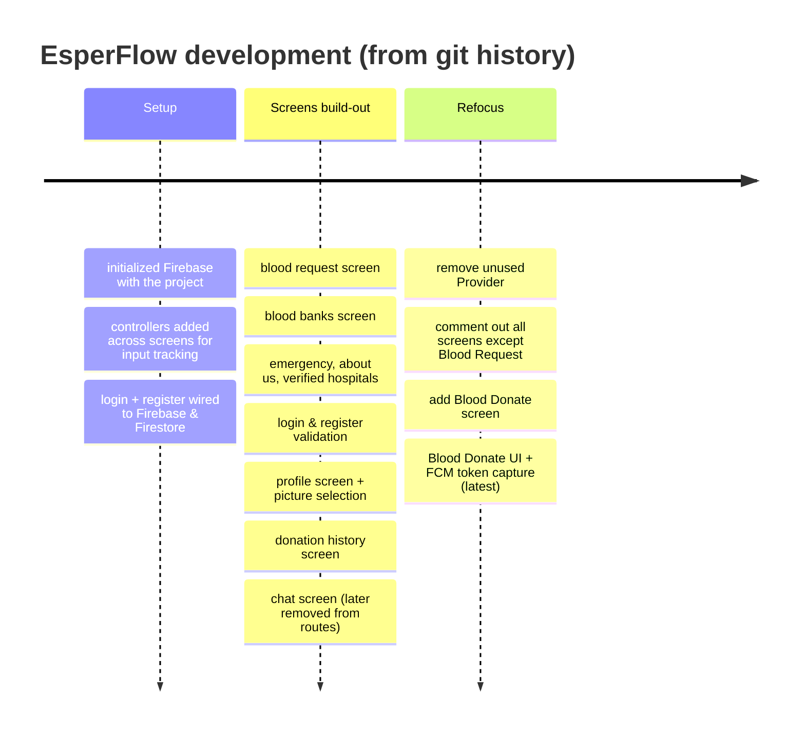

# Chapter 18 — Appendix

[← Glossary](17-glossary.md) · [Table of Contents](README.md)

---

## A. File index

Reference tables for every meaningful file. Auto-generated platform scaffolding (build output, `.dart_tool`, Xcode/Gradle boilerplate, platform icons) is summarised rather than listed line-by-line.

### A.1 Repository root

| Path | Purpose |
|------|---------|
| [`backend/`](../backend/) | **Empty** placeholder for a future server (e.g., the [notification sender](11-notifications.md)). No files. |
| [`docs/EsperFlow-Project-Book.md`](../docs/EsperFlow-Project-Book.md) | An earlier **single-file** version of this book (superseded by this `/book/` set). |
| [`book/`](README.md) | **This book** (19 files: README + 18 chapters). |
| [`frontend/`](../frontend/) | The Flutter application (everything below). |
| `.claude/settings.local.json` | Claude Code local settings (not part of the app). |

### A.2 Dart source — `frontend/lib/` (the code that matters)

| File | One-line description | Chapter |
|------|----------------------|---------|
| [`main.dart`](../frontend/lib/main.dart) | App entry: init Firebase, `MaterialApp`, route table (3 active routes) | [4](04-app-entry-and-navigation.md) |
| [`app.dart`](../frontend/lib/app.dart) | Dormant auth gate (`StreamBuilder` on `authStateChanges`) — unused | [4](04-app-entry-and-navigation.md#45-the-dormant-auth-gate-appdart) |
| [`firebase_options.dart`](../frontend/lib/firebase_options.dart) | Generated per-platform Firebase keys | [12](12-configuration-reference.md#122-firebase_optionsdart--per-platform-firebase-keys) |
| [`models/donation_history.dart`](../frontend/lib/models/donation_history.dart) | Stub model (`String? donation`), unused | [9](09-widgets-and-models.md#95-data-models--libmodels) |
| [`screens/home_screen.dart`](../frontend/lib/screens/home_screen.dart) | Dashboard grid; entry screen; 2 active tiles | [8](08-informational-screens.md#81-home-screen) |
| [`screens/login_screen.dart`](../frontend/lib/screens/login_screen.dart) | Email/password sign-in + reset dialog ✅ | [5](05-authentication.md#51-login-screen--behaviour) |
| [`screens/register_screen.dart`](../frontend/lib/screens/register_screen.dart) | Donor registration form — ⚠️ UI only, no submit | [5](05-authentication.md#52-register-screen--behaviour-and-the-gap) |
| [`screens/blood_request_screen.dart`](../frontend/lib/screens/blood_request_screen.dart) | Request-blood form — ⚠️ does not persist | [6](06-blood-request-and-donation.md#61-blood-request-screen) |
| [`screens/blood_donate_screen.dart`](../frontend/lib/screens/blood_donate_screen.dart) | Donor registration — ✅ writes `donors/{uuid}` + FCM | [6](06-blood-request-and-donation.md#62-blood-donate-screen) |
| [`screens/profile_screen.dart`](../frontend/lib/screens/profile_screen.dart) | View/edit `User/{uid}`, avatar upload, sign-out | [7](07-profile-and-donation-history.md#71-profile-screen) |
| [`screens/donation_history_screen.dart`](../frontend/lib/screens/donation_history_screen.dart) | Reads `User/{uid}/donations`; dev "add test" FAB | [7](07-profile-and-donation-history.md#72-donation-history-screen) |
| [`screens/blood_bank_screen.dart`](../frontend/lib/screens/blood_bank_screen.dart) | Static directory of 8 blood organizations + call/web | [8](08-informational-screens.md#82-blood-banks--organizations) |
| [`screens/verified_hospital_screen.dart`](../frontend/lib/screens/verified_hospital_screen.dart) | Searchable list of 21 Lahore hospitals + call/maps | [8](08-informational-screens.md#83-verified-hospitals) |
| [`screens/emergency_contact_screen.dart`](../frontend/lib/screens/emergency_contact_screen.dart) | Static emergency numbers + copy-to-clipboard | [8](08-informational-screens.md#84-emergency-contacts) |
| [`screens/faq_screen.dart`](../frontend/lib/screens/faq_screen.dart) | 7 static Q&A pairs (`QATile`) | [8](08-informational-screens.md#85-faq) |
| [`screens/about_us_screen.dart`](../frontend/lib/screens/about_us_screen.dart) | Mission + team contacts (call/email/copy) | [8](08-informational-screens.md#86-about-us) |
| [`widgets/my_text_field.dart`](../frontend/lib/widgets/my_text_field.dart) | Shared red text field w/ password toggle (`MyTextField`) | [9](09-widgets-and-models.md#91-mytextfield) |
| [`widgets/my_custom_buttom.dart`](../frontend/lib/widgets/my_custom_buttom.dart) | Shared primary button (`MyCustomButtom`) | [9](09-widgets-and-models.md#92-mycustombuttom) |
| [`widgets/menu_item_card.dart`](../frontend/lib/widgets/menu_item_card.dart) | Home grid tile (`MenuItemCard`) | [9](09-widgets-and-models.md#93-menuitemcard) |

### A.3 Tests

| File | Description | Chapter |
|------|-------------|---------|
| [`test/widget_test.dart`](../frontend/test/widget_test.dart) | Default counter smoke test — ⚠️ fails on this app | [13](13-testing.md) |
| `ios/RunnerTests/RunnerTests.swift`, `macos/RunnerTests/RunnerTests.swift` | Default XCTest stubs (not in `flutter test`) | [13](13-testing.md#132-how-to-run-tests) |

### A.4 Config & manifests

| File | Description | Chapter |
|------|-------------|---------|
| [`frontend/pubspec.yaml`](../frontend/pubspec.yaml) | Package manifest: deps, assets, version | [12](12-configuration-reference.md#121-pubspecyaml--the-project-manifest) |
| [`frontend/pubspec.lock`](../frontend/pubspec.lock) | Locked dependency versions | [B below](#b-dependency-reference) |
| [`frontend/analysis_options.yaml`](../frontend/analysis_options.yaml) | Lint config (default Flutter lints) | [12](12-configuration-reference.md#126-dart-analyzer--lints) |
| [`frontend/firebase.json`](../frontend/firebase.json) | FlutterFire tooling config | [12](12-configuration-reference.md#123-firebasejson--flutterfire-tooling-config) |
| [`frontend/README.md`](../frontend/README.md) | Default Flutter README (unmodified) | — |
| [`frontend/.metadata`](../frontend/.metadata) | Flutter SDK/migration tracking | [12](12-configuration-reference.md#127-editor--tooling-config) |
| [`android/app/build.gradle.kts`](../frontend/android/app/build.gradle.kts) | Android app build config (⚠️ debug signing, default app id) | [12](12-configuration-reference.md#124-android-configuration) |
| [`android/app/src/main/AndroidManifest.xml`](../frontend/android/app/src/main/AndroidManifest.xml) | Permissions, `<queries>`, cleartext, app label | [12](12-configuration-reference.md#124-android-configuration) |
| [`android/app/src/main/kotlin/.../MainActivity.kt`](../frontend/android/app/src/main/kotlin/com/example/esperflow/MainActivity.kt) | Stock `FlutterActivity` | [12](12-configuration-reference.md#124-android-configuration) |
| [`android/app/google-services.json`](../frontend/android/app/google-services.json) | Android Firebase config (client) | [16](16-security.md#163-secrets--keys) |

### A.5 Platform scaffolding (summary)

| Directory | What's there |
|-----------|--------------|
| [`android/`](../frontend/android/) | Gradle project, manifests, launcher icons, styles — **customised** (permissions, Firebase). |
| [`ios/`](../frontend/ios/) | Xcode project, `Info.plist`, `AppDelegate.swift`, app icons — default scaffold. |
| [`macos/`](../frontend/macos/) | Xcode project, entitlements, app icons — default scaffold. |
| [`web/`](../frontend/web/) | `index.html`, `manifest.json`, favicons — default scaffold. |
| [`windows/`](../frontend/windows/) | CMake + C++ runner — default scaffold. |
| [`linux/`](../frontend/linux/) | CMake + C++ runner — default scaffold (⚠️ Firebase not configured). |
| [`assets/images/`](../frontend/assets/images/) | `esperflow_logo.png`, `home_screen_footer.png` (declared); `h.png` (⚠️ undeclared/unused). |

---

## B. Dependency reference

Direct dependencies from [`pubspec.yaml`](../frontend/pubspec.yaml) with the exact resolved version from [`pubspec.lock`](../frontend/pubspec.lock).

| Package | Constraint | Locked | Purpose in EsperFlow |
|---------|-----------|--------|----------------------|
| `flutter` (SDK) | — | — | The framework itself |
| `firebase_core` | `^4.8.0` | 4.8.0 | Initialises Firebase (`Firebase.initializeApp`) — required by all other Firebase plugins |
| `firebase_auth` | `^6.1.3` | 6.5.0 | Email/password sign-in, password reset, `authStateChanges` ([Ch.5](05-authentication.md)) |
| `cloud_firestore` | `^6.4.0` | 6.4.0 | The document database: `donors`, `User`, `donations` ([Ch.10](10-data-and-storage.md)) |
| `firebase_messaging` | `^16.2.1` | 16.2.1 | FCM permission + token capture ([Ch.11](11-notifications.md)) |
| `image_picker` | `^1.2.1` | 1.2.1 | Pick a gallery image for the profile avatar ([Ch.7](07-profile-and-donation-history.md#71-profile-screen)) |
| `image` | `^4.7.2` | 4.7.2 | Image processing utilities (declared; minimal current use) |
| `url_launcher` | `^6.3.2` | 6.x | Launch `tel:`, `mailto:`, `https:`, maps ([Ch.8](08-informational-screens.md)) |
| `uuid` | `^4.5.3` | 4.x | Generate donor document IDs (`Uuid().v4()`) ([Ch.6](06-blood-request-and-donation.md#62-blood-donate-screen)) |
| `cupertino_icons` | `^1.0.8` | 1.0.8 | iOS-style icons |
| `flutter_lints` *(dev)* | `^6.0.0` | 6.0.0 | Recommended lint rule set ([Ch.12](12-configuration-reference.md#126-dart-analyzer--lints)) |
| `flutter_test` *(dev, SDK)* | — | — | Widget/unit test framework ([Ch.13](13-testing.md)) |

> The `pubspec.lock` also pins dozens of **transitive** packages (platform interfaces, `*_web`, `*_android`, etc.). Those are pulled in automatically by the direct deps above and aren't listed here.

---

## C. Route table

Complete mapping from [`main.dart`](../frontend/lib/main.dart) ([Chapter 4 §4.3](04-app-entry-and-navigation.md#43-the-route-table)).

| Route | Screen | Registered | Notes |
|-------|--------|:----------:|-------|
| `/` (implicit `home:`) | `HomeScreen` | ✅ | App entry; sign-out target |
| `/homeScreen` | `HomeScreen` | ✅ | Profile bottom-nav |
| `/bloodRequestScreen` | `BloodRequestScreen` | ✅ | Home tile |
| `/bloodDonateScreen` | `BloodDonateScreen` | ✅ | Home tile |
| `/profileScreen` | `ProfileScreen` | ❌ | Home avatar → **throws** |
| `/loginScreen` | `LoginScreen` | ❌ | — |
| `/registerScreen` | `RegisterScreen` | ❌ | Login link → **throws** |
| `/faqScreen` | `FaqScreen` | ❌ | — |
| `/emergencyContactScreen` | `EmergencyContactScreen` | ❌ | — |
| `/aboutUsScreen` | `AboutUsScreen` | ❌ | — |
| `/verifiedHospitalsScreen` | `VerifiedHospitalsScreen` | ❌ | — |
| `/bloodBanksScreen` | `BloodBanksScreen` | ❌ | — |
| `/donationHistoryScreen` | `DonationHistoryScreen` | ❌ | — |
| `/additionalInformationScreen` | *(no screen)* | ❌ | referenced only in comments |
| `/chatBotScreen` | *(no screen)* | ❌ | referenced in a commented Home tile |

---

## D. CLI / scripts cheat sheet

All commands run from `frontend/`.

| Command | Purpose |
|---------|---------|
| `flutter pub get` | Install dependencies |
| `flutter pub upgrade` | Upgrade within constraints |
| `flutter pub outdated` | Show newer available versions |
| `flutter run` | Debug run on selected device |
| `flutter run --release` | Optimized run |
| `flutter devices` | List available devices/emulators |
| `flutter analyze` | Static analysis / lint |
| `flutter test` | Run tests (⚠️ currently red — [Ch.13](13-testing.md)) |
| `flutter test --coverage` | Tests + `coverage/lcov.info` |
| `flutter build apk` | Android APK |
| `flutter build appbundle` | Android App Bundle (Play) |
| `flutter build ios` / `ipa` | iOS (macOS + Xcode) |
| `flutter build web` | Static web bundle |
| `flutter build windows` / `macos` / `linux` | Desktop builds |
| `flutter clean` | Remove build artifacts |
| `flutterfire configure` | Regenerate `firebase_options.dart` / `google-services.json` |
| `dart format .` | Format Dart code |

---

## E. Changelog / version history

App version is **`1.0.0+1`** (unchanged since init). There's no maintained CHANGELOG, so this is reconstructed from `git log` (most recent first). It reads as a feature-by-feature build-out, ending with the current focus on the Blood Donate/Request pair.

| Commit | Summary |
|--------|---------|
| `85a8f53` | added fcm token in blood donation screen *(latest)* |
| `d0b2a19` | blood donation screen UI implementation |
| `8ef7df9` | delete provider, it was not used |
| `3a1d72f` | update blood request screen |
| `253b8d8` | comment all other screens except blood request; add blood donate screen |
| `ffbf8aa` | added health note in blood request |
| `df10072` | added picture selection in profile screen |
| `be0fb3c` | change in home screen |
| `51fc50a` / `9286460` / `002b028` / `41d7620` | chat screen + blood request updates |
| `852b179` | verified hospitals screen updated |
| `3125772` | update blood bank screen |
| `39843ef` | new screen: donation history |
| `30e87fb` | update emergency screen |
| `5167908` | update about us screen |
| `765f32b` | profile screen + minor updates |
| `601a31b` | register screen validation |
| `36f18b1` | login screen validation |
| `8d4ca31` | update MyTextField + additional screen |
| `9fb0f3a` | new screen: blood banks |
| `fd3c851` | emergency, about us, verified hospitals content |
| `faf6153` | new screens: about us, emergency contact |
| `5e4f6e0` | implemented blood request screen |
| `308f83e` | minor improvements |
| `6eb242f` | login + register functionality with Firebase/Firestore |
| `6b95714` | Provider for register data (later removed) |
| `7ef011e` | controllers in all screens |
| `3d96d1b` | initialized Firebase *(first commit shown)* |

> The history explains several present-day quirks: a **Provider** was added then removed (hence no state-management library), a **chat screen** existed but its route is now commented out, and login/register *were* Firestore-wired earlier — which is why [Profile](07-profile-and-donation-history.md#71-profile-screen) still reads a `User` doc the current Register no longer creates.

---

## F. Coverage map (every source file → where it's documented)

For the [final consistency check](README.md): every `.dart` file under `lib/` and `test/` is covered by at least one chapter.

| File | Documented in |
|------|---------------|
| `main.dart`, `app.dart`, `firebase_options.dart` | [4](04-app-entry-and-navigation.md), [12](12-configuration-reference.md) |
| `login_screen.dart`, `register_screen.dart` | [5](05-authentication.md) |
| `blood_request_screen.dart`, `blood_donate_screen.dart` | [6](06-blood-request-and-donation.md) |
| `profile_screen.dart`, `donation_history_screen.dart` | [7](07-profile-and-donation-history.md) |
| `home_screen.dart`, `blood_bank_screen.dart`, `verified_hospital_screen.dart`, `emergency_contact_screen.dart`, `faq_screen.dart`, `about_us_screen.dart` | [8](08-informational-screens.md) |
| `menu_item_card.dart`, `my_custom_buttom.dart`, `my_text_field.dart`, `models/donation_history.dart` | [9](09-widgets-and-models.md) |
| `test/widget_test.dart` | [13](13-testing.md) |

---

[← Glossary](17-glossary.md) · [Table of Contents](README.md)
